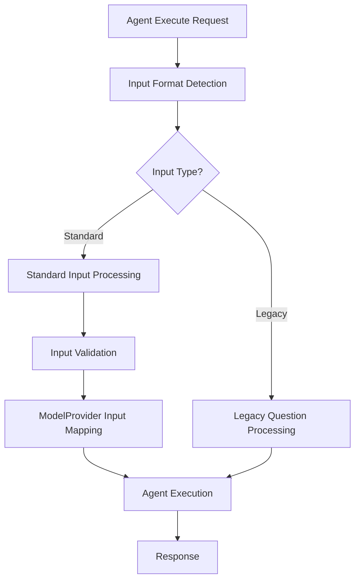
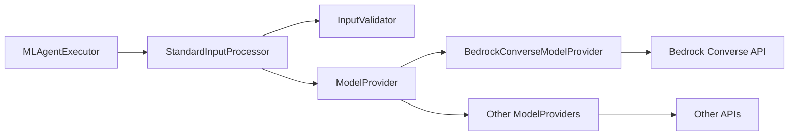

# Design Document

## Overview

This design implements a standardized input format for agent execution that supports plain text, multi-modal content blocks, and message-based conversations while maintaining backward compatibility with the existing `question` parameter approach. The solution extends the current ModelProvider architecture to handle input transformation and mapping to provider-specific request formats.

## Architecture

### High-Level Flow



### Component Interaction



## Components and Interfaces

### 1. Standard Input Data Structures

#### ContentBlock
```java
public class ContentBlock {
    private ContentType type;
    private String text; // for text content
    private ImageContent image; // for image content
    private VideoContent video; // for video content
    private DocumentContent document; // for document content
}

public enum ContentType {
    TEXT, IMAGE, VIDEO, DOCUMENT
}

public class ImageContent {
    private SourceType type;
    private String format; // "jpeg", "png", "gif", "webp"
    private String data; // URL or base64 data
}

public class VideoContent {
    private SourceType type;
    private String format; // "mp4", "mov", "avi", etc.
    private String data; // URL or base64 data
}

public class DocumentContent {
    private SourceType type;
    private String format; // "pdf", "docx", "txt", etc.
    private String data; // URL or base64 data
}

public enum SourceType {
    URL, BASE64
}
```

#### Message
```java
public class Message {
    private String role; // flexible - any role allowed
    private List<ContentBlock> content;
}
```

#### AgentInput
```java
public class AgentInput {
    private Object input; // String, List<ContentBlock>, or List<Message>
    
    public InputType getInputType() {
        if (input instanceof String) return InputType.TEXT;
        if (input instanceof List) {
            List<?> list = (List<?>) input;
            if (!list.isEmpty()) {
                if (list.get(0) instanceof ContentBlock) return InputType.CONTENT_BLOCKS;
                if (list.get(0) instanceof Message) return InputType.MESSAGES;
            }
        }
        return InputType.UNKNOWN;
    }
}

public enum InputType {
    TEXT, CONTENT_BLOCKS, MESSAGES, UNKNOWN
}
```

### 2. Input Processing Components

#### AgentInputProcessor
```java
public class AgentInputProcessor {
    
    /**
     * Processes standard input format and converts to parameters expected by agent runners
     * The key insight is that agent runners like MLChatAgentRunner expect Map<String, String> parameters
     * and primarily use the "question" parameter for the user input
     */
    public Map<String, String> processInput(AgentInput agentInput, ModelProvider provider) {
        InputType type = agentInput.getInputType();
        
        switch (type) {
            case TEXT:
                return processTextInput((String) agentInput.getInput(), provider);
            case CONTENT_BLOCKS:
                return processContentBlocks((List<ContentBlock>) agentInput.getInput(), provider);
            case MESSAGES:
                return processMessages((List<Message>) agentInput.getInput(), provider);
            default:
                throw new IllegalArgumentException("Unsupported input type");
        }
    }
    
    private Map<String, String> processTextInput(String text, ModelProvider provider) {
        // For simple text, map to the question parameter that agent runners expect
        Map<String, String> params = new HashMap<>();
        params.put("question", text);
        
        // Let the provider add any additional mappings needed for its connector
        Map<String, String> providerParams = provider.mapTextInput(text);
        params.putAll(providerParams);
        
        return params;
    }
    
    private Map<String, String> processContentBlocks(List<ContentBlock> blocks, ModelProvider provider) {
        // Convert content blocks to provider format and ensure question parameter is set
        Map<String, String> params = provider.mapContentBlocks(blocks);
        
        // Ensure we have a question parameter for agent runners
        if (!params.containsKey("question")) {
            params.put("question", extractTextFromContentBlocks(blocks));
        }
        
        return params;
    }
    
    private Map<String, String> processMessages(List<Message> messages, ModelProvider provider) {
        // Convert messages to provider format and ensure question parameter is set
        Map<String, String> params = provider.mapMessages(messages);
        
        // Ensure we have a question parameter for agent runners
        if (!params.containsKey("question")) {
            params.put("question", extractTextFromMessages(messages));
        }
        
        return params;
    }
    
    private String extractTextFromContentBlocks(List<ContentBlock> blocks) {
        // Extract text content for the question parameter
        StringBuilder text = new StringBuilder();
        for (ContentBlock block : blocks) {
            if (block.getType() == ContentType.TEXT && block.getText() != null) {
                text.append(block.getText()).append(" ");
            }
        }
        return text.toString().trim();
    }
    
    private String extractTextFromMessages(List<Message> messages) {
        // Extract the last user message text for the question parameter
        for (int i = messages.size() - 1; i >= 0; i--) {
            Message message = messages.get(i);
            if ("user".equalsIgnoreCase(message.getRole())) {
                return extractTextFromContentBlocks(message.getContent());
            }
        }
        return "";
    }
}
```

#### InputValidator
```java
public class InputValidator {
    
    public void validateAgentInput(AgentInput input) throws ValidationException {
        if (input == null || input.getInput() == null) {
            throw new ValidationException("Input cannot be null");
        }
        
        InputType type = input.getInputType();
        switch (type) {
            case CONTENT_BLOCKS:
                validateContentBlocks((List<ContentBlock>) input.getInput());
                break;
            case MESSAGES:
                validateMessages((List<Message>) input.getInput());
                break;
            case TEXT:
                validateText((String) input.getInput());
                break;
            default:
                throw new ValidationException("Invalid input format");
        }
    }
    
    private void validateContentBlocks(List<ContentBlock> blocks) throws ValidationException {
        for (ContentBlock block : blocks) {
            validateContentBlock(block);
        }
    }
    
    private void validateMessages(List<Message> messages) throws ValidationException {
        for (Message message : messages) {
            if (message.getRole() == null || message.getContent() == null) {
                throw new ValidationException("Message must have role and content");
            }
            validateContentBlocks(message.getContent());
        }
    }
    
    private void validateContentBlock(ContentBlock block) throws ValidationException {
        if (block.getType() == null) {
            throw new ValidationException("Content block must have a type");
        }
        
        switch (block.getType()) {
            case "text":
                if (block.getText() == null) {
                    throw new ValidationException("Text content block must have text field");
                }
                break;
            case "image":
                validateImageContent(block.getImage());
                break;
            case "video":
                validateVideoContent(block.getVideo());
                break;
            case "document":
                validateDocumentContent(block.getDocument());
                break;
            default:
                throw new ValidationException("Unsupported content block type: " + block.getType());
        }
    }
}
```

### 3. Enhanced ModelProvider Interface

#### Extended ModelProvider Abstract Class
```java
public abstract class ModelProvider {
    
    // Existing methods
    public abstract Connector createConnector(String modelName, Map<String, String> credential, Map<String, String> modelParameters);
    public abstract MLRegisterModelInput createModelInput(String modelName, Connector connector, Map<String, String> modelParameters);
    public abstract String getProtocol();
    public abstract String getServiceName();
    public abstract String getLLMInterface();
    
    // New input mapping methods
    public abstract Map<String, String> mapTextInput(String text);
    public abstract Map<String, String> mapContentBlocks(List<ContentBlock> blocks);
    public abstract Map<String, String> mapMessages(List<Message> messages);
    
    // Default implementation for backward compatibility
    protected Map<String, String> createDefaultParameters(String prompt) {
        Map<String, String> params = new HashMap<>();
        params.put("prompt", prompt);
        return params;
    }
}
```

#### Enhanced BedrockConverseModelProvider
```java
public class BedrockConverseModelProvider extends ModelProvider {
    
    // Existing methods remain unchanged
    
    @Override
    public Map<String, String> mapTextInput(String text) {
        Map<String, String> params = new HashMap<>();
        params.put("prompt", text);
        return params;
    }
    
    @Override
    public Map<String, String> mapContentBlocks(List<ContentBlock> blocks) {
        // Convert content blocks to Bedrock Converse format
        String messagesJson = convertContentBlocksToBedrockMessages(blocks);
        Map<String, String> params = new HashMap<>();
        params.put("messages", messagesJson);
        return params;
    }
    
    @Override
    public Map<String, String> mapMessages(List<Message> messages) {
        // Convert messages to Bedrock Converse format
        String messagesJson = convertMessagesToBedrockFormat(messages);
        Map<String, String> params = new HashMap<>();
        params.put("messages", messagesJson);
        return params;
    }
    
    private String convertContentBlocksToBedrockMessages(List<ContentBlock> blocks) {
        // Implementation to convert content blocks to Bedrock message format
        // Returns JSON string compatible with Bedrock Converse API
        return BedrockMessageConverter.convertContentBlocks(blocks);
    }
    
    private String convertMessagesToBedrockFormat(List<Message> messages) {
        // Implementation to convert messages to Bedrock format
        return BedrockMessageConverter.convertMessages(messages);
    }
}
```

### 4. Enhanced AgentMLInput

#### Updated AgentMLInput Class
```java
public class AgentMLInput extends MLInput {
    // Existing fields
    private String agentId;
    private String tenantId;
    private Boolean isAsync;
    
    // New field for standard input
    private AgentInput agentInput;
    
    // Constructor and parsing logic updated to handle both formats
    public AgentMLInput(XContentParser parser, FunctionName functionName) throws IOException {
        super();
        this.algorithm = functionName;
        ensureExpectedToken(XContentParser.Token.START_OBJECT, parser.currentToken(), parser);
        
        while (parser.nextToken() != XContentParser.Token.END_OBJECT) {
            String fieldName = parser.currentName();
            parser.nextToken();

            switch (fieldName) {
                case AGENT_ID_FIELD:
                    agentId = parser.text();
                    break;
                case TENANT_ID_FIELD:
                    tenantId = parser.textOrNull();
                    break;
                case "input": // New standard input field
                    agentInput = parseAgentInput(parser);
                    break;
                case PARAMETERS_FIELD: // Legacy support
                    Map<String, String> parameters = StringUtils.getParameterMap(parser.map());
                    inputDataset = new RemoteInferenceInputDataSet(parameters);
                    break;
                case ASYNC_FIELD:
                    isAsync = parser.booleanValue();
                    break;
                default:
                    parser.skipChildren();
                    break;
            }
        }
    }
    
    private AgentInput parseAgentInput(XContentParser parser) throws IOException {
        // Parse the input field which can be string, array of content blocks, or array of messages
        Object inputValue = parseInputValue(parser);
        return new AgentInput(inputValue);
    }
    
    public boolean hasStandardInput() {
        return agentInput != null;
    }
    
    public boolean hasLegacyInput() {
        return inputDataset != null;
    }
}
```

### 5. Enhanced MLAgentExecutor

#### Updated Execution Logic
```java
public class MLAgentExecutor implements Executable {
    
    private AgentInputProcessor inputProcessor;
    private InputValidator inputValidator;
    
    // Updated execute method
    @Override
    public void execute(Input input, ActionListener<Output> listener) {
        if (!(input instanceof AgentMLInput)) {
            throw new IllegalArgumentException("wrong input");
        }
        
        AgentMLInput agentMLInput = (AgentMLInput) input;
        
        // Process input based on format
        if (agentMLInput.hasStandardInput()) {
            processStandardInput(agentMLInput, listener);
        } else if (agentMLInput.hasLegacyInput()) {
            processLegacyInput(agentMLInput, listener);
        } else {
            throw new IllegalArgumentException("No valid input provided");
        }
    }
    
    private void processStandardInput(AgentMLInput agentMLInput, ActionListener<Output> listener) {
        try {
            // Validate standard input
            inputValidator.validateAgentInput(agentMLInput.getAgentInput());
            
            // Get agent and determine model provider
            String agentId = agentMLInput.getAgentId();
            getAgent(agentId, ActionListener.wrap(mlAgent -> {
                try {
                    // Get model provider for this agent
                    ModelProvider provider = getModelProviderForAgent(mlAgent);
                    
                    // Process input using provider - this creates the parameters that agent runners expect
                    Map<String, String> parameters = inputProcessor.processInput(
                        agentMLInput.getAgentInput(), 
                        provider
                    );
                    
                    // Create RemoteInferenceInputDataSet with processed parameters
                    // This is what the existing MLAgentExecutor logic expects
                    RemoteInferenceInputDataSet inputDataSet = new RemoteInferenceInputDataSet(parameters);
                    agentMLInput.setInputDataset(inputDataSet);
                    
                    // Continue with existing execution logic - no changes needed to agent runners
                    continueExecution(agentMLInput, mlAgent, listener);
                    
                } catch (Exception e) {
                    listener.onFailure(e);
                }
            }, listener::onFailure));
            
        } catch (ValidationException e) {
            listener.onFailure(new IllegalArgumentException("Input validation failed: " + e.getMessage()));
        }
    }
    
    private void processLegacyInput(AgentMLInput agentMLInput, ActionListener<Output> listener) {
        // Existing legacy processing logic remains unchanged
        String agentId = agentMLInput.getAgentId();
        getAgent(agentId, ActionListener.wrap(mlAgent -> {
            continueExecution(agentMLInput, mlAgent, listener);
        }, listener::onFailure));
    }
    
    private ModelProvider getModelProviderForAgent(MLAgent mlAgent) {
        // Determine model provider from agent configuration
        if (mlAgent.getModel() != null && mlAgent.getModel().getModelProvider() != null) {
            return ModelProviderFactory.getProvider(mlAgent.getModel().getModelProvider());
        }
        
        // For legacy agents, try to infer from LLM interface or other metadata
        String llmInterface = mlAgent.getParameters() != null ? 
            mlAgent.getParameters().get("_llm_interface") : null;
        
        if (llmInterface != null && llmInterface.startsWith("bedrock/converse")) {
            return ModelProviderFactory.getProvider("bedrock/converse");
        }
        
        // Default fallback - could be configurable
        throw new IllegalArgumentException("Cannot determine model provider for agent");
    }
}
```

## Data Models

### Input Format Examples

#### 1. Plain Text Input
```json
{
  "input": "What is the weather like today?"
}
```

#### 2. Multi-modal Content Blocks
```json
{
  "input": [
    {
      "type": "text",
      "text": "What do you see in this image?"
    },
    {
      "type": "image",
      "image": {
        "type": "url",
        "format": "jpeg",
        "data": "https://example.com/image.jpg"
      }
    }
  ]
}
```

#### 3. Messages Format
```json
{
  "input": [
    {
      "role": "user",
      "content": [
        {
          "type": "text",
          "text": "Hello, how are you?"
        }
      ]
    },
    {
      "role": "assistant", 
      "content": [
        {
          "type": "text",
          "text": "I'm doing well, thank you!"
        }
      ]
    },
    {
      "role": "user",
      "content": [
        {
          "type": "text",
          "text": "Can you help me with this document?"
        },
        {
          "type": "document",
          "document": {
            "type": "base64",
            "format": "pdf",
            "data": "base64encodeddata..."
          }
        }
      ]
    }
  ]
}
```

## Error Handling

### Validation Errors
- **Invalid Input Format**: HTTP 400 with detailed format requirements
- **Unsupported Content Type**: HTTP 400 with list of supported types
- **Missing Required Fields**: HTTP 400 with specific field requirements
- **Invalid Content Block Structure**: HTTP 400 with structure requirements

### Processing Errors
- **Model Provider Not Found**: HTTP 500 with provider information
- **Input Mapping Failed**: HTTP 500 with mapping error details
- **Agent Configuration Invalid**: HTTP 400 with configuration requirements

### Error Response Format
```json
{
  "error": {
    "type": "ValidationException",
    "message": "Invalid input format",
    "details": {
      "field": "input",
      "expected": "string, array of content blocks, or array of messages",
      "received": "object"
    }
  }
}
```

## Testing Strategy

### Unit Tests
1. **StandardInputProcessor Tests**
   - Test text input processing
   - Test content block processing
   - Test message processing
   - Test provider-specific mapping

2. **InputValidator Tests**
   - Test validation of each input type
   - Test error cases and edge conditions
   - Test content block validation

3. **ModelProvider Tests**
   - Test input mapping methods for each provider
   - Test backward compatibility
   - Test error handling

### Integration Tests
1. **End-to-End Agent Execution**
   - Test with standard input formats
   - Test with legacy input formats
   - Test mixed scenarios

2. **Multi-modal Content Tests**
   - Test image processing
   - Test video processing
   - Test document processing

3. **Backward Compatibility Tests**
   - Test existing agents continue to work
   - Test legacy parameter format
   - Test migration scenarios

### Performance Tests
1. **Input Processing Performance**
   - Benchmark input validation
   - Benchmark format conversion
   - Memory usage analysis

2. **Large Content Handling**
   - Test with large base64 content
   - Test with multiple content blocks
   - Test with long message histories