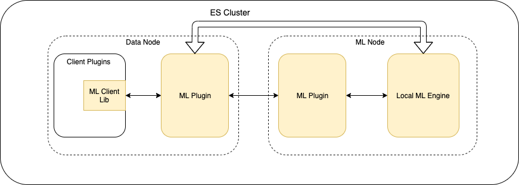

# RFC: Machine Learning Framework of Open Distro for Elasticsearch
## Introduction
Machine Learning Framework for Open Distro for Elasticsearch is a new solution that make it easy to develop new machine learning feature. It allows engineers to leverage existing opensource machine learning algorithms and reduce the efforts to build any new machine learning feature. It also removes the necessity from engineers to manage the machine learning tasks which will help to speed the feature developing process.

## Problem Statement
Machine learning helps to automate data analytics workflow and provide deeper and more comprehensive insights to the customers. Anomaly Detection, K-NN are machine learning features already available in Open Distro for Elastic Search(ODFE). But until today, the challenge is high to build a new machine learning feature for Open Distro. The reasons include:

* **Disruption to Elasticsearch Core features**. Machine learning is very computationally intensive. But currently  there is no way to add dedicated computation resources in ODFE for machine learning jobs, hence these jobs have to  share same resources with Core features, such as: indexing and searching.  In the Anomaly Detection(AD) plugin, we have to carefully distribute models and limit the data size to run the AD job to avoid the impact on Core  features. When more and more ML features are added into ODFE, it will  become much harder to manage. 
* **Lack of support for machine learning algorithms.** In AD plugin, we have to write Random Cut Forest(RCF) algorithm in  Java during our development. In Learning to Rank(LTR), customers need to train ranking models by themselves. For SQL plugin, they need forecasting algorithms.
* **Lack of resource management mechanism between  multiple machine learning jobs.** For example,  if we also use the same way as AD to implement new features, such as Root  Cause Analysis(RCA), Forecasting, then how to coordinate the resources  between multi features will be very hard under the condition: no impact on  core features

Due to these limitations, it will add lots of complexity in design, and need more engineering efforts to implement any new machine learning feature.  

In the meanwhile,  we observe more and more machine learning features required to be supported in elasticsearch to power end users’ business needs. For instance:

* **Forecasting**: Forecasting is very popular in time series data analysis. Although the past data isn’t always an indicator for the future, it’s still very powerful tool used in some use cases, such as capacity planning to scale up/down the service hosts in IT operation. 
* **Root Cause Analysis in DevOps**: Today lots of customers use elasticsearch for IT operations.. In the modern IT environment which becomes more complicated, identifying the root cause of an outage or incident becomes more and more challenges since it need gather all of the pieces information in the ecosystem, such as log, traces, metrics. Machine learning technique is a great fit to address this issue by building topology models of the system automatically, and understanding the similarity and casual relations between events, etc. 
* **Machine Learning in SIEM**:  SIEM(Security Information and Event Management) is another domain in elasticsearch. Machine learning is also very useful in SIEM to help facilitate security analytics, and it can reduce the effort on sophisticated tasks, enable real time threat analysis and uncover anomalies.

  
## Solution 

The solution is to introduce a new Machine Learning node type inside the Elasticsearch cluster, and all ML jobs only run in the ML nodes. ES functionalities:security, node communication, node management, can be leveraged: With this new node type, the customers can choose if the dedicated ML nodes are needed or not. For instance, it would be better to have dedicated nodes for production case to reduce the impact on indexing/search features and increase the resource capacity for ML jobs.

The major components include:

* **Unified Client Interfaces:** clients can use common interfaces for training and inference tasks, and then follow the algorithm interface to give right input parameters, such as input data, hyperparameters.  A client library will be built for easy use.
* **ML Plugin:** ML plugin will help to initiate the ML nodes, and choose the right nodes and allocate the resources for each request, and manage machine learning tasks with monitoring and failure handing supports, and store the model results; It will be the host for java based built-in algorithms; and also it will be the bridge for the communication between ES and ML engine.
* **ML Engine** : This engine will be a new service, located in the ML nodes inside the elasticsearch cluster.. It will run the single node machine learning algorithm. A python based engine will be implemented to support python based ML algorithms

## Request for Comments: ##

We would like comments and feedback on the proposal for building Machine Learning Framework [here](https://github.com/opendistro-for-elasticsearch/machine-learning/issues/xxx). Some specific questions we’re seeking feedback include

* Types of problems you are facing when using elasticsearch for machine learning use cases?
* What kind of new features would you like to add in this project?
* What are the machine learning algorithms you are most interested in?

