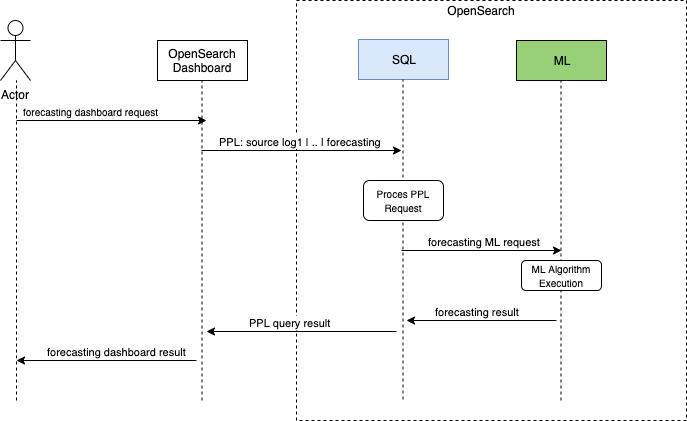

# RFC: Machine Learning Framework
## Introduction
Machine Learning Framework for OpenSearch is a new solution that makes it easy to develop new machine learning features. It allows engineers to leverage existing open-source machine learning algorithms, and reduce the efforts to build any new machine learning feature. It also removes the necessity from engineers to manage the machine learning tasks which will help to speed the feature developing process.

## Problem Statement
Machine learning helps to automate data analytics workflow and provide deeper and more comprehensive insights to the customers. Anomaly Detection, K-NN are machine learning features already available in OpenSearch. And we observe more and more machine learning features required to be supported in OpenSearch to power end users’ business needs. For instance:

* **Forecasting**: Forecasting is very popular in time series data analysis. Although the past data isn’t always an indicator for the future, it’s still very powerful tool used in some use cases, such as capacity planning to scale up/down the service hosts in IT operation. 
* **Root Cause Analysis in DevOps**: today customers use OpenSearch for IT operations. In the modern IT environment which becomes more complicated, identifying the root cause of an outage or incident becomes more and more challenges since it need gather all of the pieces information in the ecosystem, such as log, traces, metrics. Machine learning technique is a great fit to address this issue by building topology models of the system automatically, and understanding the similarity and casual relations between events, etc.  
* **Machine Learning in SIEM**: SIEM(Security Information and Event Management) is another domain in OpenSearch. Machine learning is also very useful in SIEM to help facilitate security analytics, and it can reduce the effort on sophisticated tasks, enable real time threat analysis and uncover anomalies.

But until today, the challenge is significant to build a new machine learning feature inside OpenSearch. The reasons include:

* **Disruption to OpenSearch Core features**. Machine learning is very computationally intensive. But currently  there is no way to add dedicated computation resources in OpenSearch for machine learning jobs, hence these jobs have to  share same resources with Core features, such as: indexing and searching.  In the Anomaly Detection(AD) plugin, we observe that AD jobs can cause the latency increasing on search request, and cause circuit breaker exception on memory usage. To address this, we have to carefully distribute models and limit the data size to run the AD job. When more and more ML features are added into OpenSearch, it will become much harder to manage. 
* **Lack of support for machine learning algorithms.** In AD plugin, we had to write Random Cut Forest (RCF) algorithm in Java during our development. In Learning to Rank (LTR), customers need to train ranking models by themselves. For SQL plugin, they need forecasting algorithms. Also, customers would like to use the external ML framework such as Sagemaker, tensorflow, and MLSpark. Currently,  the data need be exported to outside of elasticsearch, such as s3 first to do the job. 
* **Lack of resource management mechanism between multiple machine learning jobs.** For example, if we also use the same way as AD to implement new features, then how to coordinate the resources between multi features will be very hard.

  
## Solution 
The solution is to introduce a new Machine Learning Framework inside the OpenSearch cluster, and all ML jobs only run and are managed in it. Existing functionalities: security, node communication, node management, can be leveraged.  The major functionalities in this solution include:

* **Unified Client Interfaces:** clients can use common interfaces for training and inference tasks, and then follow the algorithm interface to give right input parameters, such as input data, hyperparameters.  A client library will be built for easy use.
* **ML Plugin:** ML plugin will help to initiate the ML nodes, and choose the right nodes and allocate the resources for each request, and manage machine learning tasks with monitoring and failure handing supports, and store the model results; it will be the bridge for the communication between OpenSearch process and ML engine.
* **ML Engine**: This engine will be the host for ML algorithms.  Java based machine learning algorithms will be supported in the first release. 

## Use Case Examples

### Forecasting with PPL in OpenSearch Dashboard 

Let’s say that we need one new feature in OpenSearch to generate a forecasting dashboard based on log data, e.g. cpu load, traffic pattern.  To achieve this, one alternative solution to integrate the PPL query with ML framework: 

* Add Forecasting algorithm support in ML framework
* Implement Forecasting PPL command by wrapping the ML Forecasting Interface


The e2e workflow will be:

*  Kibana sends request to OpenSearch with PPL query, e.g. 
   ```
   source log1 | filter time, cpu_load | forecasting forcast_k=10,conf_interval=95
   ```
* The SQL plugin handles this request: to retrieve the index data and do the filtering, and then use the Forecasting PPL command to get the output
*  The forecasting PPL command will call ML forecasting interface to run the ML algorithm and generate the results. Here is one example of Forecasting algorithm interface: 
    ```
    input_data: {
            time: e.g. "2020-09-24 09:10"
            field_to_forecast: e.g.the value of the field for forecasting. in the above example, it is cpu_load
        }
        
        parameter: {
           forecast_k: e.g.how many points into the future should be forecasted
           conf_interval: <1..99> parameter is the confidence interval in percentage around forecasted values. Input an integer between 1 and 99 where a larger number means a greater tolerance for forecast uncertainty. 
        }
        
        output:[ {
                time: e.g. "2020-09-24 09:10", predicted future time points
                field_forcasted_value: forcasted future value of the field
            },
            ...
        ]
    ```
* Kibana can use the forecasting result to build a dashboard for customers.


## Request for Comments: ##

We would like comments and feedback on the proposal for building Machine Learning Framework [here](https://github.com/opendistro-for-elasticsearch/machine-learning/issues/xxx). Some specific questions we’re seeking feedback include

* What are the machine learning end user features you are interested in or have built yourselves based on opensearch?
* What are types of problems you are facing when using opensearch for machine learning use cases?
* What kind of new features would you like to add in this project?
* What are the machine learning algorithms you are most interested in?

