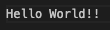

# Amazon Textract connector blueprint 

Amazon Textract uses ML to extract text, handwriting, layout elements, and data from scanned documents. For more information about Amazon Textract, see  [Amazon Textract](https://docs.aws.amazon.com/textract/).

## Detect text with DetectDocumentText API

This tutorial shows how to create an OpenSearch connector for an Amazon Textract model. The model detects text in the input document by using the Amazon Textract [DetectDocumentText API](https://docs.aws.amazon.com/textract/latest/dg/API_DetectDocumentText.html).

Note: This functionality is available in OpenSearch 2.14.0 or later.

### Step 1: Add the connector endpoint to trusted URLs

```json
PUT /_cluster/settings
{
    "persistent": {
        "plugins.ml_commons.trusted_connector_endpoints_regex": [
            "^https://textract\\..*[a-z0-9-]\\.amazonaws\\.com$"
        ]
    }
}
```

### Step 2: Create a connector for Amazon Textract

- If you are using self-managed Opensearch, supply your AWS credentials. Credential owner has to have a permission to access Amazon Textract [DetectDocumentText API](https://docs.aws.amazon.com/textract/latest/dg/API_DetectDocumentText.html). For more information, see [AWS documentation](https://docs.aws.amazon.com/textract/latest/dg/security-iam.html)

- You can choose any region from [supported regions](https://docs.aws.amazon.com/general/latest/gr/comprehend.html)


```json
POST /_plugins/_ml/connectors/_create
{
  "name": "Amazon textract connector: detect document texts",
  "description": "my test model",
  "version": "1.0",
  "protocol": "aws_sigv4",
  "credential": {
    "access_key": "<PLEASE ADD YOUR AWS ACCESS KEY HERE>",
    "secret_key": "<PLEASE ADD YOUR AWS SECRET KEY HERE>",
    "session_token": "<PLEASE ADD YOUR AWS SECURITY TOKEN HERE>"
  },
  "parameters": {
    "region": "<PLEASE ADD YOUR AWS REGION like us-west-2>",
    "service_name": "textract"
  },
  "actions": [
    {
      "action_type": "predict",
      "method": "POST",
      "headers": {
        "content-type": "application/x-amz-json-1.1",
        "X-Amz-Target": "Textract.DetectDocumentText"
      },
      "url": "https://${parameters.service_name}.${parameters.region}.amazonaws.com",
      "request_body": "{  \"Document\": { \"Bytes\": \"${parameters.bytes}\" }  } "
    }
  ]
}
```

If using the AWS Opensearch Service, you can provide an IAM role ARN that allows access to the Amazon Comprehend service. For more information, see following documents:
- [AWS documentation](https://docs.aws.amazon.com/opensearch-service/latest/developerguide/ml-amazon-connector.html)
- [AIConnectorHelper tutorial](https://github.com/opensearch-project/ml-commons/blob/2.x/docs/tutorials/aws/AIConnectorHelper.ipynb)
- [Semantic search with Amazon Bedrock Titan embedding text model](https://github.com/opensearch-project/ml-commons/blob/2.x/docs/tutorials/aws/semantic_search_with_bedrock_titan_embedding_model.md)


```json
POST /_plugins/_ml/connectors/_create
{
  "name": "Amazon textract connector: detect document texts",
  "description": "my test model",
  "version": "1.0",
  "protocol": "aws_sigv4",
  "credential": {
    "roleArn": "<PLEASE ADD YOUR AWS ROLE ARN HERE>"
  },
  "parameters": {
    "region": "<PLEASE ADD YOUR AWS REGION like us-west-2>",
    "service_name": "textract"
  },
  "actions": [
    {
      "action_type": "predict",
      "method": "POST",
      "headers": {
        "content-type": "application/x-amz-json-1.1",
        "X-Amz-Target": "Textract.DetectDocumentText"
      },
      "url": "https://${parameters.service_name}.${parameters.region}.amazonaws.com",
      "request_body": "{  \"Document\": { \"Bytes\": \"${parameters.bytes}\" }  } "
    }
  ]
}
```

Sample response:
```json
{
  "connector_id": "eYNtJ5AB18bTACCQzX90"
}
```

### Step 3: Create a model group

```json
POST /_plugins/_ml/model_groups/_register
{
    "name": "amazon_textract_model_group",
    "description": "This is an example description"
}
```

Sample response:
```json
{
  "model_group_id": "gINuJ5AB18bTACCQYX_F",
  "status": "CREATED"
}
```

### Step 4: Register and deploy the model

```json
POST /_plugins/_ml/models/_register?deploy=true
{
    "name": "amazon_textract_detect_document_text",
    "function_name": "remote",
    "model_group_id": "gINuJ5AB18bTACCQYX_F",
    "description": "test model",
    "connector_id": "eYNtJ5AB18bTACCQzX90"
}
```

Sample response:
```json
{
  "task_id": "h4NuJ5AB18bTACCQ83_t",
  "status": "CREATED",
  "model_id": "iINuJ5AB18bTACCQ9H8B"
}
```
### Step 5: Test the model inference

Test with image 


Git clone ml-commons code to your local `git clone https://github.com/opensearch-project/ml-commons.git`

Then Use this python code to generate base64 string
```python
import base64

def image_to_base64(image_path):
    with open(image_path, 'rb') as image_file:
        return base64.b64encode(image_file.read()).decode('utf-8')

image_path = '/your_ml_commons_local_path/docs/remote_inference_blueprints/images/hello.png'
base64_str = image_to_base64(image_path)
print(base64_str)
```
Run predict with generated base64 string.
```json
POST /_plugins/_ml/models/iINuJ5AB18bTACCQ9H8B/_predict
{
  "parameters": {
    "bytes": "iVBORw0KGgoAAAANSUhEUgAAAG4AAAAeCAYAAADNeSs6AAABWmlDQ1BJQ0MgUHJvZmlsZQAAKJF1kL1Lw1AUxU9stPiBWOzg4FCog0ot0mao4lI7aMEhtBY/cEnS2BTS+Ejj1+zg4iwODk7+BUpdCo7ughUHcXQXsmiJ95lqW8ULl/vjcLjvvAv0iApjpgigYjl2bmkxsr6xGQm+og8h9COKqKJVWVqWV8iC79ld7gMEPu9n+K6Uen583cgG9IV6vqDPn/z1d9VAUa9qND+opzVmO4AwSSzvO4zzAXHYplDEfFe45PMFZ9Xnqy/Pai5DfEc8ohlKkfiROKZ26KUOrpi7WisDTz+kW4U8zWHqcWSQhIRlpDAHSvCPV2p5d8BwCBtllGDAQQRpUhhM6MRZWNAQR4w4gVlqid/49+3amvFMq7foqaO2Vh4DbuL0zVBbm3gBRveA+hlTbOXnooIrVreTCZ8Ha0Dvqee9rQHBKaDZ8Lz3muc1L4HAE3DrfgIXSWDddJguWQAAAFZlWElmTU0AKgAAAAgAAYdpAAQAAAABAAAAGgAAAAAAA5KGAAcAAAASAAAARKACAAQAAAABAAAAbqADAAQAAAABAAAAHgAAAABBU0NJSQAAAFNjcmVlbnNob3TofmF7AAAB1WlUWHRYTUw6Y29tLmFkb2JlLnhtcAAAAAAAPHg6eG1wbWV0YSB4bWxuczp4PSJhZG9iZTpuczptZXRhLyIgeDp4bXB0az0iWE1QIENvcmUgNi4wLjAiPgogICA8cmRmOlJERiB4bWxuczpyZGY9Imh0dHA6Ly93d3cudzMub3JnLzE5OTkvMDIvMjItcmRmLXN5bnRheC1ucyMiPgogICAgICA8cmRmOkRlc2NyaXB0aW9uIHJkZjphYm91dD0iIgogICAgICAgICAgICB4bWxuczpleGlmPSJodHRwOi8vbnMuYWRvYmUuY29tL2V4aWYvMS4wLyI+CiAgICAgICAgIDxleGlmOlBpeGVsWURpbWVuc2lvbj4zMDwvZXhpZjpQaXhlbFlEaW1lbnNpb24+CiAgICAgICAgIDxleGlmOlBpeGVsWERpbWVuc2lvbj4xMTA8L2V4aWY6UGl4ZWxYRGltZW5zaW9uPgogICAgICAgICA8ZXhpZjpVc2VyQ29tbWVudD5TY3JlZW5zaG90PC9leGlmOlVzZXJDb21tZW50PgogICAgICA8L3JkZjpEZXNjcmlwdGlvbj4KICAgPC9yZGY6UkRGPgo8L3g6eG1wbWV0YT4KguVc7gAABblJREFUaAXtWVlIlG0UPu5LZaIpKYWppOJWoKIWWqkIeueCF0HeieKNF6K4IE7oRVcZSqRpYCoaRDeBqGg3uSN0oZTikqaYoZm5lGkuf8+Bd35nnG8+Z379c+A7MPMuZ/nO9571nTG7fPnyPilgcidgbnIaKwrzCSiGM1FHUAynGM5ET8BE1baU0tvGxkYKpeyfghNQUuUpMIIxKkhGnBC2tbUlpsp4ik5A1nDG6Oro6EjJycnM+vXrV3r9+rWGmLt375KtrS3v1dfX097engb+NC1iY2PJw8ODVers7KS5uTlJ9RISEmh6eprGxsYkaY4LIZkqY2Ji6Pnz5wQjCGhsbKT8/HyxlBzt7OzI29ubbt68SUlJSYfovLy8KDg4mOLj4+k4amldXR2VlJQceg70z8vLO7RvyMafHyj4XaBrUFCQXta0tDS6c+eOBk16ejq9ePFCY08srly5wrjw8HCxdeRR0nDm5pIoWeELCwtUXFxM796900lbXl7OTqETacTmysoKOTs7H+K0tram2dnZQ/uGbCAj4F3290/uByYzMzNDVGJao1Olvb09FRUVsTdC0sePH0mlUtHv378NVuIgAyIxJyeHzpw5w7Jevnx5KNUepMf8y5cv5O/vz9v379/ndAU+HAj0ghMWFBRQQEAAz0EPXVdXV5kHkYRM0tbWRkh3lpaW9PbtW3ry5Anjpb4uXbpEpaWldO7cOfr+/TvzSdEe975sWJWVlVFFRQV/8EICcBCenp6EA0IqQNinpKQItFEjDhqpDd5dW1tLiFzUQ3d3d73yPn36xDXTycmJfH196datW6wPmFBvUlNTOTX39fXRq1evyNXVlXJzc9UyUW+trKzYaD09PfTs2TP69u2bGi81yczMJEQ1ohKGg4z/C/61hMQTl5eX1VF08eJFNdXVq1cJjQfqGQDee/v2bcl8rmbUM8Gh4+VRS9+8eUNDQ0P09OlTiouLo4aGBknOiYkJsrCwoIiICNrc3GQjwqngAOvr6xQZGUk/fvygx48fs4zAwECC/trQ0dFBTU1N2tuSazgrDN3e3k69vb3sbNrEv379kkyzwAGgs6Ega7hHjx6xN0EwDhRw4cIFTkPw1NDQUN7DtWFjY4Pnxn65ubkx6/DwMI9ra2u0s7NDLi4uekXCcIDo6Giamppio9y4cUOtz9mzZ2lxcVEtY3Jykvz8/NRrMenq6hJT2dHBwYGdDLIAcBDoqg3IGiIla+NEUCwtLWmjZNeyhtMlQaSRDx8+cArVRYM91DupJmd7e5vZELHC4xDBAEQD6hAcA+kZaUgf/Pz5k3Z3d7ltb2lp4SyAzlW07pCPNCoAnSLotQFNjj4QVxjQwKkgA7IA6I4PlhLe/PPV3d3NH7E+OOJ87t27d3DryHPZGqdLEu5d8ODr169TWFgYk1y7do0SExM1yPv7+/mFoqKi6Pz58xo4GB2pDIrjyoEUOT4+znu4QiDKsrKymGdgYECDV9cC0Y4aCVrIxvzz589MOjo6SogQtOqINHwM9XLQI6JRH0V5mJ+f5zSMGpyRkaFLLa7RyFrg04aQkBACTvsKoU2nay1pOLlL8YMHDwg5GkUezUlhYaG6wxQPGhkZoffv31N2djbV1NRoNBkwWmtrKxu+urqaGxukW6RjpMyqqiquWYODgyxDyJQakQWQquBQ4AHMzMzwiOYBeDQTKpWK9yorK3k8+KXvnZubmwkpF3zoJAGIbjjEw4cP2YC6otjHx4fQG4BOG/CewIkLvjZe39pM6h9wcTGW+8kL0QJvwn1JFFt9DzwKDo0Gmgt4tEijR+GTo0FtRrSIFCpHfxQ8dMXBw0n0Gf4osgyh+c+GM+RhCu3xnYBkqjy+RyiSTuIEZLtKkTJP4uGKTONPQIk448/ur3JKRpxcU/JXtVYeTkrEmagTKIZTDGeiJ2CiaisRpxjORE/ARNVWIs5EDfcPXLUlH3d6XY0AAAAASUVORK5CYII="
  }
}
```

Sample response:
```json
{
  "inference_results": [
    {
      "output": [
        {
          "name": "response",
          "dataAsMap": {
            "Blocks": [
              {
                "BlockType": "PAGE",
                "Geometry": {
                  "BoundingBox": {
                    "Height": 1,
                    "Left": 0,
                    "Top": 0,
                    "Width": 1
                  },
                  "Polygon": [
                    {
                      "X": 0,
                      "Y": 0.000012461323422030546
                    },
                    {
                      "X": 1,
                      "Y": 0
                    },
                    {
                      "X": 1,
                      "Y": 1
                    },
                    {
                      "X": 0.0000751028346712701,
                      "Y": 1
                    }
                  ]
                },
                "Id": "3a0ef2a2-992e-4908-bb3e-042306b04a4c",
                "Relationships": [
                  {
                    "Ids": [
                      "e41b648b-17c4-4b98-8626-8035fcd72fd8"
                    ],
                    "Type": "CHILD"
                  }
                ]
              },
              {
                "BlockType": "LINE",
                "Confidence": 95.57785034179688,
                "Geometry": {
                  "BoundingBox": {
                    "Height": 0.4151805639266968,
                    "Left": 0.048208076506853104,
                    "Top": 0.22988344728946686,
                    "Width": 0.8436829447746277
                  },
                  "Polygon": [
                    {
                      "X": 0.048208076506853104,
                      "Y": 0.23779110610485077
                    },
                    {
                      "X": 0.8914051651954651,
                      "Y": 0.22988344728946686
                    },
                    {
                      "X": 0.8918910026550293,
                      "Y": 0.6347987055778503
                    },
                    {
                      "X": 0.04881633445620537,
                      "Y": 0.6450639963150024
                    }
                  ]
                },
                "Id": "e41b648b-17c4-4b98-8626-8035fcd72fd8",
                "Relationships": [
                  {
                    "Ids": [
                      "8b71481a-f846-4bd6-ab4a-2a751da1e439",
                      "63b62784-7e51-47bd-8020-b68f99adfb3a"
                    ],
                    "Type": "CHILD"
                  }
                ],
                "Text": "Hello World!!"
              },
              {
                "BlockType": "WORD",
                "Confidence": 99.83317565917969,
                "Geometry": {
                  "BoundingBox": {
                    "Height": 0.3905462622642517,
                    "Left": 0.048214200884103775,
                    "Top": 0.2387302666902542,
                    "Width": 0.33665478229522705
                  },
                  "Polygon": [
                    {
                      "X": 0.048214200884103775,
                      "Y": 0.24189195036888123
                    },
                    {
                      "X": 0.3843369781970978,
                      "Y": 0.2387302666902542
                    },
                    {
                      "X": 0.3848689794540405,
                      "Y": 0.6252208948135376
                    },
                    {
                      "X": 0.0487927570939064,
                      "Y": 0.6292765140533447
                    }
                  ]
                },
                "Id": "8b71481a-f846-4bd6-ab4a-2a751da1e439",
                "Text": "Hello",
                "TextType": "PRINTED"
              },
              {
                "BlockType": "WORD",
                "Confidence": 91.3225326538086,
                "Geometry": {
                  "BoundingBox": {
                    "Height": 0.4104575514793396,
                    "Left": 0.43615883588790894,
                    "Top": 0.22988344728946686,
                    "Width": 0.45573216676712036
                  },
                  "Polygon": [
                    {
                      "X": 0.43615883588790894,
                      "Y": 0.23415282368659973
                    },
                    {
                      "X": 0.8914051651954651,
                      "Y": 0.22988344728946686
                    },
                    {
                      "X": 0.8918910026550293,
                      "Y": 0.6347987055778503
                    },
                    {
                      "X": 0.4367106258869171,
                      "Y": 0.6403409838676453
                    }
                  ]
                },
                "Id": "63b62784-7e51-47bd-8020-b68f99adfb3a",
                "Text": "World!!",
                "TextType": "PRINTED"
              }
            ],
            "DetectDocumentTextModelVersion": "1.0",
            "DocumentMetadata": {
              "Pages": 1
            }
          }
        }
      ],
      "status_code": 200
    }
  ]
}
```

### Step 6: Create an ingest pipeline with an `ml_inference` processor

The [ML inference processor](https://opensearch.org/docs/latest/ingest-pipelines/processors/ml-inference/) passes a source field to a model, extracts the model output, and inserts it into a target field. 

This example processor works as follows:
1. Extracts values from the `image_bytes` field and passes the values to the `bytes` parameter.
1. Invokes the Amazon Textract DetectDocumentText API providing the `bytes` parameter.
1. Extracts values from the DetectDocumentText API response with JSON path.
1. Inserts the extracted values into the `detected_texts` field.

```json
PUT /_ingest/pipeline/detect_document_text_pipeline
{
  "processors": [
    {
      "ml_inference": {
        "model_id": "iINuJ5AB18bTACCQ9H8B",
        "input_map": [
          {
            "bytes": "image_bytes" 
          }
        ],
        "output_map": [
          {
            "detected_texts": "$.Blocks[?(@.BlockType=='LINE')].Text"
          }
        ]
      }
    }
  ]
}
```

Sample response:
```json
{
  "acknowledged": true
}
```

### Step 7: Test the ingest pipeline processor

```json
POST /_ingest/pipeline/detect_document_text_pipeline/_simulate
{
  "docs": [
    {
      "_index": "my_books",
      "_id": "1",
      "_source": {
        "image_bytes": "iVBORw0KGgoAAAANSUhEUgAAAG4AAAAeCAYAAADNeSs6AAABWmlDQ1BJQ0MgUHJvZmlsZQAAKJF1kL1Lw1AUxU9stPiBWOzg4FCog0ot0mao4lI7aMEhtBY/cEnS2BTS+Ejj1+zg4iwODk7+BUpdCo7ughUHcXQXsmiJ95lqW8ULl/vjcLjvvAv0iApjpgigYjl2bmkxsr6xGQm+og8h9COKqKJVWVqWV8iC79ld7gMEPu9n+K6Uen583cgG9IV6vqDPn/z1d9VAUa9qND+opzVmO4AwSSzvO4zzAXHYplDEfFe45PMFZ9Xnqy/Pai5DfEc8ohlKkfiROKZ26KUOrpi7WisDTz+kW4U8zWHqcWSQhIRlpDAHSvCPV2p5d8BwCBtllGDAQQRpUhhM6MRZWNAQR4w4gVlqid/49+3amvFMq7foqaO2Vh4DbuL0zVBbm3gBRveA+hlTbOXnooIrVreTCZ8Ha0Dvqee9rQHBKaDZ8Lz3muc1L4HAE3DrfgIXSWDddJguWQAAAFZlWElmTU0AKgAAAAgAAYdpAAQAAAABAAAAGgAAAAAAA5KGAAcAAAASAAAARKACAAQAAAABAAAAbqADAAQAAAABAAAAHgAAAABBU0NJSQAAAFNjcmVlbnNob3TofmF7AAAB1WlUWHRYTUw6Y29tLmFkb2JlLnhtcAAAAAAAPHg6eG1wbWV0YSB4bWxuczp4PSJhZG9iZTpuczptZXRhLyIgeDp4bXB0az0iWE1QIENvcmUgNi4wLjAiPgogICA8cmRmOlJERiB4bWxuczpyZGY9Imh0dHA6Ly93d3cudzMub3JnLzE5OTkvMDIvMjItcmRmLXN5bnRheC1ucyMiPgogICAgICA8cmRmOkRlc2NyaXB0aW9uIHJkZjphYm91dD0iIgogICAgICAgICAgICB4bWxuczpleGlmPSJodHRwOi8vbnMuYWRvYmUuY29tL2V4aWYvMS4wLyI+CiAgICAgICAgIDxleGlmOlBpeGVsWURpbWVuc2lvbj4zMDwvZXhpZjpQaXhlbFlEaW1lbnNpb24+CiAgICAgICAgIDxleGlmOlBpeGVsWERpbWVuc2lvbj4xMTA8L2V4aWY6UGl4ZWxYRGltZW5zaW9uPgogICAgICAgICA8ZXhpZjpVc2VyQ29tbWVudD5TY3JlZW5zaG90PC9leGlmOlVzZXJDb21tZW50PgogICAgICA8L3JkZjpEZXNjcmlwdGlvbj4KICAgPC9yZGY6UkRGPgo8L3g6eG1wbWV0YT4KguVc7gAABblJREFUaAXtWVlIlG0UPu5LZaIpKYWppOJWoKIWWqkIeueCF0HeieKNF6K4IE7oRVcZSqRpYCoaRDeBqGg3uSN0oZTikqaYoZm5lGkuf8+Bd35nnG8+Z379c+A7MPMuZ/nO9571nTG7fPnyPilgcidgbnIaKwrzCSiGM1FHUAynGM5ET8BE1baU0tvGxkYKpeyfghNQUuUpMIIxKkhGnBC2tbUlpsp4ik5A1nDG6Oro6EjJycnM+vXrV3r9+rWGmLt375KtrS3v1dfX097engb+NC1iY2PJw8ODVers7KS5uTlJ9RISEmh6eprGxsYkaY4LIZkqY2Ji6Pnz5wQjCGhsbKT8/HyxlBzt7OzI29ubbt68SUlJSYfovLy8KDg4mOLj4+k4amldXR2VlJQceg70z8vLO7RvyMafHyj4XaBrUFCQXta0tDS6c+eOBk16ejq9ePFCY08srly5wrjw8HCxdeRR0nDm5pIoWeELCwtUXFxM796900lbXl7OTqETacTmysoKOTs7H+K0tram2dnZQ/uGbCAj4F3290/uByYzMzNDVGJao1Olvb09FRUVsTdC0sePH0mlUtHv378NVuIgAyIxJyeHzpw5w7Jevnx5KNUepMf8y5cv5O/vz9v379/ndAU+HAj0ghMWFBRQQEAAz0EPXVdXV5kHkYRM0tbWRkh3lpaW9PbtW3ry5Anjpb4uXbpEpaWldO7cOfr+/TvzSdEe975sWJWVlVFFRQV/8EICcBCenp6EA0IqQNinpKQItFEjDhqpDd5dW1tLiFzUQ3d3d73yPn36xDXTycmJfH196datW6wPmFBvUlNTOTX39fXRq1evyNXVlXJzc9UyUW+trKzYaD09PfTs2TP69u2bGi81yczMJEQ1ohKGg4z/C/61hMQTl5eX1VF08eJFNdXVq1cJjQfqGQDee/v2bcl8rmbUM8Gh4+VRS9+8eUNDQ0P09OlTiouLo4aGBknOiYkJsrCwoIiICNrc3GQjwqngAOvr6xQZGUk/fvygx48fs4zAwECC/trQ0dFBTU1N2tuSazgrDN3e3k69vb3sbNrEv379kkyzwAGgs6Ega7hHjx6xN0EwDhRw4cIFTkPw1NDQUN7DtWFjY4Pnxn65ubkx6/DwMI9ra2u0s7NDLi4uekXCcIDo6Giamppio9y4cUOtz9mzZ2lxcVEtY3Jykvz8/NRrMenq6hJT2dHBwYGdDLIAcBDoqg3IGiIla+NEUCwtLWmjZNeyhtMlQaSRDx8+cArVRYM91DupJmd7e5vZELHC4xDBAEQD6hAcA+kZaUgf/Pz5k3Z3d7ltb2lp4SyAzlW07pCPNCoAnSLotQFNjj4QVxjQwKkgA7IA6I4PlhLe/PPV3d3NH7E+OOJ87t27d3DryHPZGqdLEu5d8ODr169TWFgYk1y7do0SExM1yPv7+/mFoqKi6Pz58xo4GB2pDIrjyoEUOT4+znu4QiDKsrKymGdgYECDV9cC0Y4aCVrIxvzz589MOjo6SogQtOqINHwM9XLQI6JRH0V5mJ+f5zSMGpyRkaFLLa7RyFrg04aQkBACTvsKoU2nay1pOLlL8YMHDwg5GkUezUlhYaG6wxQPGhkZoffv31N2djbV1NRoNBkwWmtrKxu+urqaGxukW6RjpMyqqiquWYODgyxDyJQakQWQquBQ4AHMzMzwiOYBeDQTKpWK9yorK3k8+KXvnZubmwkpF3zoJAGIbjjEw4cP2YC6otjHx4fQG4BOG/CewIkLvjZe39pM6h9wcTGW+8kL0QJvwn1JFFt9DzwKDo0Gmgt4tEijR+GTo0FtRrSIFCpHfxQ8dMXBw0n0Gf4osgyh+c+GM+RhCu3xnYBkqjy+RyiSTuIEZLtKkTJP4uGKTONPQIk448/ur3JKRpxcU/JXtVYeTkrEmagTKIZTDGeiJ2CiaisRpxjORE/ARNVWIs5EDfcPXLUlH3d6XY0AAAAASUVORK5CYII="
      }
    }
  ]
}
```

Sample response:
```json
{
  "docs": [
    {
      "doc": {
        "_index": "my_books",
        "_id": "1",
        "_source": {
          "detected_texts": [
            "Hello World!!"
          ],
          "image_bytes": "iVBORw0KGgoAAAANSUhEUgAAAG4AAAAeCAYAAADNeSs6AAABWmlDQ1BJQ0MgUHJvZmlsZQAAKJF1kL1Lw1AUxU9stPiBWOzg4FCog0ot0mao4lI7aMEhtBY/cEnS2BTS+Ejj1+zg4iwODk7+BUpdCo7ughUHcXQXsmiJ95lqW8ULl/vjcLjvvAv0iApjpgigYjl2bmkxsr6xGQm+og8h9COKqKJVWVqWV8iC79ld7gMEPu9n+K6Uen583cgG9IV6vqDPn/z1d9VAUa9qND+opzVmO4AwSSzvO4zzAXHYplDEfFe45PMFZ9Xnqy/Pai5DfEc8ohlKkfiROKZ26KUOrpi7WisDTz+kW4U8zWHqcWSQhIRlpDAHSvCPV2p5d8BwCBtllGDAQQRpUhhM6MRZWNAQR4w4gVlqid/49+3amvFMq7foqaO2Vh4DbuL0zVBbm3gBRveA+hlTbOXnooIrVreTCZ8Ha0Dvqee9rQHBKaDZ8Lz3muc1L4HAE3DrfgIXSWDddJguWQAAAFZlWElmTU0AKgAAAAgAAYdpAAQAAAABAAAAGgAAAAAAA5KGAAcAAAASAAAARKACAAQAAAABAAAAbqADAAQAAAABAAAAHgAAAABBU0NJSQAAAFNjcmVlbnNob3TofmF7AAAB1WlUWHRYTUw6Y29tLmFkb2JlLnhtcAAAAAAAPHg6eG1wbWV0YSB4bWxuczp4PSJhZG9iZTpuczptZXRhLyIgeDp4bXB0az0iWE1QIENvcmUgNi4wLjAiPgogICA8cmRmOlJERiB4bWxuczpyZGY9Imh0dHA6Ly93d3cudzMub3JnLzE5OTkvMDIvMjItcmRmLXN5bnRheC1ucyMiPgogICAgICA8cmRmOkRlc2NyaXB0aW9uIHJkZjphYm91dD0iIgogICAgICAgICAgICB4bWxuczpleGlmPSJodHRwOi8vbnMuYWRvYmUuY29tL2V4aWYvMS4wLyI+CiAgICAgICAgIDxleGlmOlBpeGVsWURpbWVuc2lvbj4zMDwvZXhpZjpQaXhlbFlEaW1lbnNpb24+CiAgICAgICAgIDxleGlmOlBpeGVsWERpbWVuc2lvbj4xMTA8L2V4aWY6UGl4ZWxYRGltZW5zaW9uPgogICAgICAgICA8ZXhpZjpVc2VyQ29tbWVudD5TY3JlZW5zaG90PC9leGlmOlVzZXJDb21tZW50PgogICAgICA8L3JkZjpEZXNjcmlwdGlvbj4KICAgPC9yZGY6UkRGPgo8L3g6eG1wbWV0YT4KguVc7gAABblJREFUaAXtWVlIlG0UPu5LZaIpKYWppOJWoKIWWqkIeueCF0HeieKNF6K4IE7oRVcZSqRpYCoaRDeBqGg3uSN0oZTikqaYoZm5lGkuf8+Bd35nnG8+Z379c+A7MPMuZ/nO9571nTG7fPnyPilgcidgbnIaKwrzCSiGM1FHUAynGM5ET8BE1baU0tvGxkYKpeyfghNQUuUpMIIxKkhGnBC2tbUlpsp4ik5A1nDG6Oro6EjJycnM+vXrV3r9+rWGmLt375KtrS3v1dfX097engb+NC1iY2PJw8ODVers7KS5uTlJ9RISEmh6eprGxsYkaY4LIZkqY2Ji6Pnz5wQjCGhsbKT8/HyxlBzt7OzI29ubbt68SUlJSYfovLy8KDg4mOLj4+k4amldXR2VlJQceg70z8vLO7RvyMafHyj4XaBrUFCQXta0tDS6c+eOBk16ejq9ePFCY08srly5wrjw8HCxdeRR0nDm5pIoWeELCwtUXFxM796900lbXl7OTqETacTmysoKOTs7H+K0tram2dnZQ/uGbCAj4F3290/uByYzMzNDVGJao1Olvb09FRUVsTdC0sePH0mlUtHv378NVuIgAyIxJyeHzpw5w7Jevnx5KNUepMf8y5cv5O/vz9v379/ndAU+HAj0ghMWFBRQQEAAz0EPXVdXV5kHkYRM0tbWRkh3lpaW9PbtW3ry5Anjpb4uXbpEpaWldO7cOfr+/TvzSdEe975sWJWVlVFFRQV/8EICcBCenp6EA0IqQNinpKQItFEjDhqpDd5dW1tLiFzUQ3d3d73yPn36xDXTycmJfH196datW6wPmFBvUlNTOTX39fXRq1evyNXVlXJzc9UyUW+trKzYaD09PfTs2TP69u2bGi81yczMJEQ1ohKGg4z/C/61hMQTl5eX1VF08eJFNdXVq1cJjQfqGQDee/v2bcl8rmbUM8Gh4+VRS9+8eUNDQ0P09OlTiouLo4aGBknOiYkJsrCwoIiICNrc3GQjwqngAOvr6xQZGUk/fvygx48fs4zAwECC/trQ0dFBTU1N2tuSazgrDN3e3k69vb3sbNrEv379kkyzwAGgs6Ega7hHjx6xN0EwDhRw4cIFTkPw1NDQUN7DtWFjY4Pnxn65ubkx6/DwMI9ra2u0s7NDLi4uekXCcIDo6Giamppio9y4cUOtz9mzZ2lxcVEtY3Jykvz8/NRrMenq6hJT2dHBwYGdDLIAcBDoqg3IGiIla+NEUCwtLWmjZNeyhtMlQaSRDx8+cArVRYM91DupJmd7e5vZELHC4xDBAEQD6hAcA+kZaUgf/Pz5k3Z3d7ltb2lp4SyAzlW07pCPNCoAnSLotQFNjj4QVxjQwKkgA7IA6I4PlhLe/PPV3d3NH7E+OOJ87t27d3DryHPZGqdLEu5d8ODr169TWFgYk1y7do0SExM1yPv7+/mFoqKi6Pz58xo4GB2pDIrjyoEUOT4+znu4QiDKsrKymGdgYECDV9cC0Y4aCVrIxvzz589MOjo6SogQtOqINHwM9XLQI6JRH0V5mJ+f5zSMGpyRkaFLLa7RyFrg04aQkBACTvsKoU2nay1pOLlL8YMHDwg5GkUezUlhYaG6wxQPGhkZoffv31N2djbV1NRoNBkwWmtrKxu+urqaGxukW6RjpMyqqiquWYODgyxDyJQakQWQquBQ4AHMzMzwiOYBeDQTKpWK9yorK3k8+KXvnZubmwkpF3zoJAGIbjjEw4cP2YC6otjHx4fQG4BOG/CewIkLvjZe39pM6h9wcTGW+8kL0QJvwn1JFFt9DzwKDo0Gmgt4tEijR+GTo0FtRrSIFCpHfxQ8dMXBw0n0Gf4osgyh+c+GM+RhCu3xnYBkqjy+RyiSTuIEZLtKkTJP4uGKTONPQIk448/ur3JKRpxcU/JXtVYeTkrEmagTKIZTDGeiJ2CiaisRpxjORE/ARNVWIs5EDfcPXLUlH3d6XY0AAAAASUVORK5CYII="
        },
        "_ingest": {
          "timestamp": "2024-06-17T18:41:53.409021465Z"
        }
      }
    }
  ]
}
```

You have now successfully created an Amazon Textract Detect Document Text connector and ingest pipeline.

