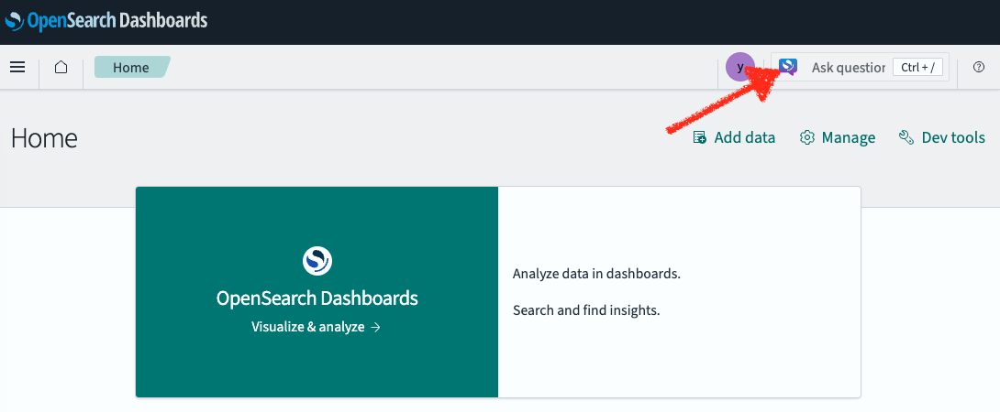
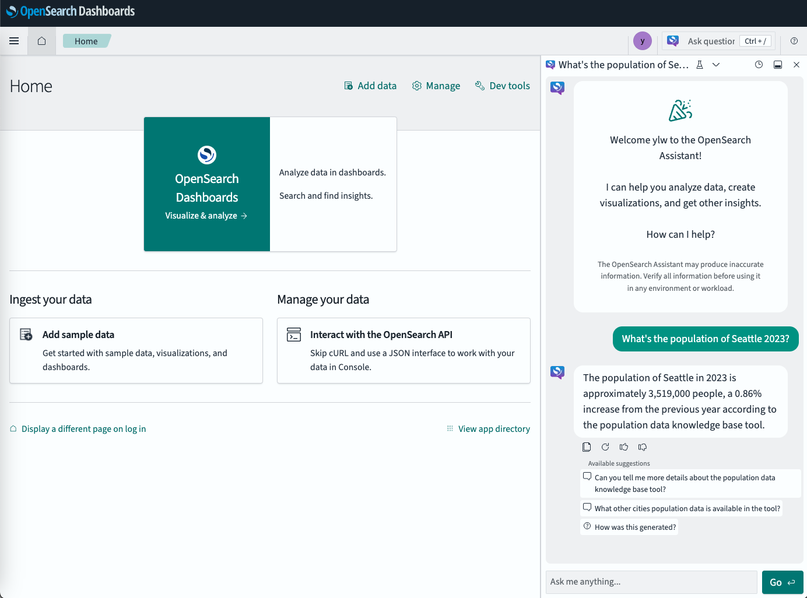

# Topic

> Agent Framework is an experimental feature released in OpenSearch 2.12 and is not recommended for use in a production environment. For updates on the progress of the feature or if you want to leave feedback, see the associated [GitHub issue](https://github.com/opensearch-project/ml-commons/issues/1161).

One round of LLM call is not enough to answer some questions. For example, LLM can't answer how many errors in your log index of last week as it doesn't know your data.
Agent is to solve such complex problems. It can run tools to get more information as LLM context.

Three types of agent released in OpenSearch 2.12 (all experimental):
1. `flow`: Runs tools sequentially, in the order specified in its configuration. The workflow of a flow agent is fixed. It doesn't store chat messages.
2. `conversational_flow`: Runs tools sequentially, in the order specified in its configuration. The workflow of a flow agent is fixed. Stores history message so that users can ask follow-up questions.
3. `conversational`: Use LLM to reason what action to take dynamically until find the final answer or reach max iteration limit. 

This tutorial will show you how to use `conversational` agent to build your own chatbot in OpenSearch.

Note: You should replace the placeholders with prefix `your_` with your own value

# Steps

## 1. Set up knowledge base

Follow step 0 and step 1 of [RAG_with_conversational_flow_agent](./RAG_with_conversational_flow_agent.md) to set up
knowledge base index `test_population_data` which contains population data of US cities.

Use similar way to prepare another index `test_stock_price_data` which contains historical stock price.

Create ingest pipeline
```
PUT /_ingest/pipeline/test_stock_price_data_pipeline
{
    "description": "text embedding pipeline",
    "processors": [
        {
            "text_embedding": {
                "model_id": "your_text_embedding_model_id",
                "field_map": {
                    "stock_price_history": "stock_price_history_embedding"
                }
            }
        }
    ]
}
```
Create index 
```
PUT test_stock_price_data
{
  "mappings": {
    "properties": {
      "stock_price_history": {
        "type": "text"
      },
      "stock_price_history_embedding": {
        "type": "knn_vector",
        "dimension": 384
      }
    }
  },
  "settings": {
    "index": {
      "knn.space_type": "cosinesimil",
      "default_pipeline": "test_stock_price_data_pipeline",
      "knn": "true"
    }
  }
}
```
Ingest data
```
POST _bulk
{"index": {"_index": "test_stock_price_data"}}
{"stock_price_history": "This is the historical montly stock price record for Amazon.com, Inc. (AMZN) with CSV format.\nDate,Open,High,Low,Close,Adj Close,Volume\n2023-03-01,93.870003,103.489998,88.120003,103.290001,103.290001,1349240300\n2023-04-01,102.300003,110.860001,97.709999,105.449997,105.449997,1224083600\n2023-05-01,104.949997,122.919998,101.150002,120.580002,120.580002,1432891600\n2023-06-01,120.690002,131.490005,119.930000,130.360001,130.360001,1242648800\n2023-07-01,130.820007,136.649994,125.919998,133.679993,133.679993,1058754800\n2023-08-01,133.550003,143.630005,126.410004,138.009995,138.009995,1210426200\n2023-09-01,139.460007,145.860001,123.040001,127.120003,127.120003,1120271900\n2023-10-01,127.279999,134.479996,118.349998,133.089996,133.089996,1224564700\n2023-11-01,133.960007,149.259995,133.710007,146.089996,146.089996,1025986900\n2023-12-01,146.000000,155.630005,142.809998,151.940002,151.940002,931128600\n2024-01-01,151.539993,161.729996,144.050003,155.199997,155.199997,953344900\n2024-02-01,155.869995,175.000000,155.619995,174.449997,174.449997,437720800\n"}
{"index": {"_index": "test_stock_price_data"}}
{"stock_price_history": "This is the historical montly stock price record for Apple Inc. (AAPL) with CSV format.\nDate,Open,High,Low,Close,Adj Close,Volume\n2023-03-01,146.830002,165.000000,143.899994,164.899994,164.024475,1520266600\n2023-04-01,164.270004,169.850006,159.779999,169.679993,168.779099,969709700\n2023-05-01,169.279999,179.350006,164.309998,177.250000,176.308914,1275155500\n2023-06-01,177.699997,194.479996,176.929993,193.970001,193.207016,1297101100\n2023-07-01,193.779999,198.229996,186.600006,196.449997,195.677261,996066400\n2023-08-01,196.240005,196.729996,171.960007,187.869995,187.130997,1322439400\n2023-09-01,189.490005,189.979996,167.619995,171.210007,170.766846,1337586600\n2023-10-01,171.220001,182.339996,165.669998,170.770004,170.327972,1172719600\n2023-11-01,171.000000,192.929993,170.119995,189.949997,189.458313,1099586100\n2023-12-01,190.330002,199.619995,187.449997,192.529999,192.284637,1062774800\n2024-01-01,187.149994,196.380005,180.169998,184.399994,184.164993,1187219300\n2024-02-01,183.990005,191.050003,179.250000,188.850006,188.609329,420063900\n"}
{"index": {"_index": "test_stock_price_data"}}
{"stock_price_history": "This is the historical montly stock price record for NVIDIA Corporation (NVDA) with CSV format.\nDate,Open,High,Low,Close,Adj Close,Volume\n2023-03-01,231.919998,278.339996,222.970001,277.769989,277.646820,1126373100\n2023-04-01,275.089996,281.100006,262.200012,277.489990,277.414032,743592100\n2023-05-01,278.399994,419.380005,272.399994,378.339996,378.236420,1169636000\n2023-06-01,384.890015,439.899994,373.559998,423.019989,422.904175,1052209200\n2023-07-01,425.170013,480.880005,413.459991,467.290009,467.210449,870489500\n2023-08-01,464.600006,502.660004,403.109985,493.549988,493.465942,1363143600\n2023-09-01,497.619995,498.000000,409.799988,434.989990,434.915924,857510100\n2023-10-01,440.299988,476.089996,392.299988,407.799988,407.764130,1013917700\n2023-11-01,408.839996,505.480011,408.690002,467.700012,467.658905,914386300\n2023-12-01,465.250000,504.329987,450.100006,495.220001,495.176453,740951700\n2024-01-01,492.440002,634.929993,473.200012,615.270020,615.270020,970385300\n2024-02-01,621.000000,721.849976,616.500000,721.330017,721.330017,355346500\n"}
{"index": {"_index": "test_stock_price_data"}}
{"stock_price_history": "This is the historical montly stock price record for Meta Platforms, Inc. (META) with CSV format.\n\nDate,Open,High,Low,Close,Adj Close,Volume\n2023-03-01,174.589996,212.169998,171.429993,211.940002,211.940002,690053000\n2023-04-01,208.839996,241.690002,207.130005,240.320007,240.320007,446687900\n2023-05-01,238.619995,268.649994,229.850006,264.720001,264.720001,486968500\n2023-06-01,265.899994,289.790009,258.880005,286.980011,286.980011,480979900\n2023-07-01,286.700012,326.200012,284.850006,318.600006,318.600006,624605100\n2023-08-01,317.540009,324.140015,274.380005,295.890015,295.890015,423147800\n2023-09-01,299.369995,312.869995,286.790009,300.209991,300.209991,406686600\n2023-10-01,302.739990,330.540009,279.399994,301.269989,301.269989,511307900\n2023-11-01,301.850006,342.920013,301.850006,327.149994,327.149994,329270500\n2023-12-01,325.480011,361.899994,313.660004,353.959991,353.959991,332813800\n2024-01-01,351.320007,406.359985,340.010010,390.140015,390.140015,347020200\n2024-02-01,393.940002,485.959991,393.049988,473.279999,473.279999,294260900\n"}
{"index": {"_index": "test_stock_price_data"}}
{"stock_price_history": "This is the historical montly stock price record for Microsoft Corporation (MSFT) with CSV format.\n\nDate,Open,High,Low,Close,Adj Close,Volume\n2023-03-01,250.759995,289.269989,245.610001,288.299988,285.953064,747635000\n2023-04-01,286.519989,308.929993,275.369995,307.260010,304.758759,551497100\n2023-05-01,306.970001,335.940002,303.399994,328.390015,325.716766,600807200\n2023-06-01,325.929993,351.470001,322.500000,340.540009,338.506226,547588700\n2023-07-01,339.190002,366.779999,327.000000,335.920013,333.913818,666764400\n2023-08-01,335.190002,338.540009,311.549988,327.760010,325.802582,479456700\n2023-09-01,331.309998,340.859985,309.450012,315.750000,314.528809,416680700\n2023-10-01,316.279999,346.200012,311.209991,338.109985,336.802307,540907000\n2023-11-01,339.790009,384.299988,339.649994,378.910004,377.444519,563880300\n2023-12-01,376.760010,378.160004,362.899994,376.040009,375.345886,522003700\n2024-01-01,373.859985,415.320007,366.500000,397.579987,396.846130,528399000\n2024-02-01,401.829987,420.820007,401.799988,409.489990,408.734131,237639700\n"}
{"index": {"_index": "test_stock_price_data"}}
{"stock_price_history": "This is the historical montly stock price record for Alphabet Inc. (GOOG) with CSV format.\n\nDate,Open,High,Low,Close,Adj Close,Volume\n2023-03-01,90.160004,107.510002,89.769997,104.000000,104.000000,725477100\n2023-04-01,102.669998,109.629997,102.379997,108.220001,108.220001,461670700\n2023-05-01,107.720001,127.050003,104.500000,123.370003,123.370003,620317400\n2023-06-01,123.500000,129.550003,116.910004,120.970001,120.970001,521386300\n2023-07-01,120.320000,134.070007,115.830002,133.110001,133.110001,525456900\n2023-08-01,130.854996,138.399994,127.000000,137.350006,137.350006,463482000\n2023-09-01,138.429993,139.929993,128.190002,131.850006,131.850006,389593900\n2023-10-01,132.154999,142.380005,121.459999,125.300003,125.300003,514877100\n2023-11-01,125.339996,141.100006,124.925003,133.919998,133.919998,405635900\n2023-12-01,133.320007,143.945007,129.399994,140.929993,140.929993,482059400\n2024-01-01,139.600006,155.199997,136.850006,141.800003,141.800003,428771200\n2024-02-01,143.690002,150.695007,138.169998,147.139999,147.139999,231934100\n"}

```

## 2. Create LLM

For more information, see [Remote models](https://opensearch.org/docs/latest/ml-commons-plugin/remote-models/index/).

This tutorial uses the [Bedrock Claude model](https://aws.amazon.com/bedrock/claude/). You can also use other LLMs.

1. Create connector:
```
POST /_plugins/_ml/connectors/_create
{
  "name": "BedRock Claude instant-v1 Connector ",
  "description": "The connector to BedRock service for claude model",
  "version": 1,
  "protocol": "aws_sigv4",
  "parameters": {
    "region": "us-east-1",
    "service_name": "bedrock",
    "anthropic_version": "bedrock-2023-05-31",
    "max_tokens_to_sample": 8000,
    "temperature": 0.0001,
    "response_filter": "$.completion"
  },
  "credential": {
    "access_key": "your_aws_access_key",
    "secret_key": "your_aws_secret_key",
    "session_token": "your_aws_session_token"
  },
  "actions": [
    {
      "action_type": "predict",
      "method": "POST",
      "url": "https://bedrock-runtime.us-east-1.amazonaws.com/model/anthropic.claude-instant-v1/invoke",
      "headers": {
        "content-type": "application/json",
        "x-amz-content-sha256": "required"
      },
      "request_body": "{\"prompt\":\"${parameters.prompt}\", \"max_tokens_to_sample\":${parameters.max_tokens_to_sample}, \"temperature\":${parameters.temperature},  \"anthropic_version\":\"${parameters.anthropic_version}\" }"
    }
  ]
}
```

Note the connector ID; you'll use it to register the model.

2. Register model:

```
POST /_plugins/_ml/models/_register
{
    "name": "Bedrock Claude Instant model",
    "function_name": "remote",
    "description": "Bedrock Claude instant-v1 model",
    "connector_id": "your_connector_id"
}
```
Note the LLM model id from the response; you will use it to create agent.

3. Deploy model
```
POST /_plugins/_ml/models/your_LLM_model_id/_deploy
```

4. Test predict
```
POST /_plugins/_ml/models/your_LLM_model_id/_predict
{
  "parameters": {
    "prompt": "\n\nHuman: how are you? \n\nAssistant:"
  }
}
```


## 3. Agent with default prompt

### 3.1 Create agent

Create agent with `conversational` type. 

Agent consists of these parts:
1. Meta info: `name`, `type`, `description`
2. LLM: Agent use LLM to reason what's next step, choose tool and prepare tool input.
3. Tools: Tool is a function which can be executed by Agent. Each tool can define its own `name`, `description` and `parameters`.
4. Memory: Store chatting messages. OpenSearch 2.12 only support one memory type `conversation_index`


Explanation of key parameters:
1. `conversational`: This agent type has built-in prompt. You can override it with your own prompt, check step 4
2. `app_type`: This is for reference purpose, so you can differentiate multiple agents.
3. `llm`: This part defines LLM configuration
   1. `"max_iteration": 5`:  Agent runs the LLM a maximum of 5 times
   2. `"response_filter": "$.completion"` is to retrieve the LLM answer from the Bedrock Claude model response.
   3. `"message_history_limit": 5`: Agent retrieves a maxium of 5 most recent history messages and added to LLM context. Set as `0` will not retrieve history message.
   4. `disable_trace`: If `true` will not store trace data in memory. Each message has its own trace data which is the detail steps of how the message generated.
4. `memory`: This part defines how to store messages. In 2.12, only support `conversation_index` memory, which stores messages in memory index.
5. Tools: This tutorial doesn't explain details for each tool. You can read more details on [Tools doc](https://opensearch.org/docs/latest/ml-commons-plugin/agents-tools/tools/index/). 
   1. LLM will reason which tool to run and prepare tool's input. 
   2. If you want to include the tool's output in response, you can set `"include_output_in_agent_response": true`. In this tutorial, will include `PPLTool` output in response, check sample response in step 3.2. 
   3. By default, the tool's `name` is same with tool's `type` and each tool has its default description. But you can override
them. 
   4. Each tool in `tools` list must have unique name. For example, the demo agent below defines two `VectorDBTool` with different
names `population_data_knowledge_base` and `stock_price_data_knowledge_base`. They also have custom description to make LLM 
understand what they can do easily.

Note: You don't need to configure all of these tools in your agent. You can simply configure those that are relevant to your use case.
```
POST _plugins/_ml/agents/_register
{
  "name": "Chat Agent with Claude",
  "type": "conversational",
  "description": "this is a test agent",
  "app_type": "os_chat",
  "llm": {
    "model_id": "your_llm_model_id_from_step2",
    "parameters": {
      "max_iteration": 5,
      "response_filter": "$.completion",
      "message_history_limit": 5,
      "disable_trace": false
    }
  },
  "memory": {
    "type": "conversation_index"
  },
  "tools": [
    {
      "type": "PPLTool",
      "parameters": {
        "model_id": "your_llm_model_id_from_step2",
        "model_type": "CLAUDE",
        "execute": true
      },
      "include_output_in_agent_response": true
    },
    {
      "type": "VisualizationTool",
      "parameters": {
        "index": ".kibana"
      },
      "include_output_in_agent_response": true
    },
    {
      "type": "VectorDBTool",
      "name": "population_data_knowledge_base",
      "description": "This tool provide population data of US cities.",
      "parameters": {
        "input": "${parameters.question}",
        "index": "test_population_data",
        "source_field": [
          "population_description"
        ],
        "model_id": "your_embedding_model_id_from_step1",
        "embedding_field": "population_description_embedding",
        "doc_size": 3
      }
    },
    {
      "type": "VectorDBTool",
      "name": "stock_price_data_knowledge_base",
      "description": "This tool provide stock price data.",
      "parameters": {
        "input": "${parameters.question}",
        "index": "test_stock_price_data",
        "source_field": [
          "stock_price_history"
        ],
        "model_id": "your_embedding_model_id_from_step1",
        "embedding_field": "stock_price_history_embedding",
        "doc_size": 3
      }
    },
    {
      "type": "CatIndexTool"
    },
    {
      "type": "SearchAnomalyDetectorsTool"
    },
    {
      "type": "SearchAnomalyResultsTool"
    },
    {
      "type": "SearchMonitorsTool"
    },
    {
      "type": "SearchAlertsTool"
    }
  ]
}
```
Note the agent id, you will use it in next step.

### 3.2 Test agent

Tips: 
1. You can see detail steps of one agent execution by
   1. enabling verbose model : `"verbose": true`
   2. or calling Get Trace API: `GET _plugins/_ml/memory/message/your_message_id/traces`

2. Sometimes LLM has hallucination. It may choose wrong tool to solve your problem especially when you configured many tools. You can use these options to solve:
   1. Avoid configuring many tools in agent.
   2. Fine tune tool description to clarify what the tool can do. 
   3. Tell LLM which tool to use in question, for example `Can you use PPLTool to query index opensearch_dashboards_sample_data_ecommerce to calculate how many orders in last week?`
   4. Specify which tool to use when execute agent, 
   for example, you can tell agent to only use `PPLTool` and `CatIndexTool` in current request.
   ```
   POST _plugins/_ml/agents/your_agent_id/_execute
   {
     "parameters": {
       "question": "Can you query with index opensearch_dashboards_sample_data_ecommerce to calculate how many orders in last week?",
       "verbose": false,
       "selected_tools": ["PPLTool", "CatIndexTool"]
     }
   }
   ```


#### 3.2.1 Test `PPLTool`
```
POST _plugins/_ml/agents/your_agent_id/_execute
{
  "parameters": {
    "question": "Can you query with index opensearch_dashboards_sample_data_ecommerce to calculate how many orders in last week?",
    "verbose": false
  }
}
```
As we set `"include_output_in_agent_response": true` for `PPLTool`, the response contains `PPLTool.output` in `additional_info`.
```
{
  "inference_results": [
    {
      "output": [
        {
          "name": "memory_id",
          "result": "TkJwyI0Bn3OCesyvzuH9"
        },
        {
          "name": "parent_interaction_id",
          "result": "T0JwyI0Bn3OCesyvz-EI"
        },
        {
          "name": "response",
          "dataAsMap": {
            "response": "The tool response from the PPLTool shows that there were 3812 orders in the opensearch_dashboards_sample_data_ecommerce index within the last week.",
            "additional_info": {
              "PPLTool.output": [
                """{"ppl":"source\u003dopensearch_dashboards_sample_data_ecommerce| where order_date \u003e DATE_SUB(NOW(), INTERVAL 1 WEEK) | stats COUNT() AS count","executionResult":"{\n  \"schema\": [\n    {\n      \"name\": \"count\",\n      \"type\": \"integer\"\n    }\n  ],\n  \"datarows\": [\n    [\n      3812\n    ]\n  ],\n  \"total\": 1,\n  \"size\": 1\n}"}"""
              ]
            }
          }
        }
      ]
    }
  ]
}
```

Find trace data:
```
GET _plugins/_ml/memory/message/T0JwyI0Bn3OCesyvz-EI/traces
```

#### 3.2.2 Test `population_data_knowledge_base` tool.

You can use `"verbose": true` to see detail steps.
```
POST _plugins/_ml/agents/your_agent_id/_execute
{
  "parameters": {
    "question": "What's the population increase of Seattle from 2021 to 2023?",
    "verbose": true
  }
}
```
Response
```
{
  "inference_results": [
    {
      "output": [
        {
          "name": "memory_id",
          "result": "LkJuyI0Bn3OCesyv3-Ef"
        },
        {
          "name": "parent_interaction_id",
          "result": "L0JuyI0Bn3OCesyv3-Er"
        },
        {
          "name": "response",
          "result": """{
  "thought": "Let me check the population data tool",
  "action": "population_data_knowledge_base",
  "action_input": "{'question': 'What is the population increase of Seattle from 2021 to 2023?', 'cities': ['Seattle']}"
}"""
        },
        {
          "name": "response",
          "result": """{"_index":"test_population_data","_source":{"population_description":"Chart and table of population level and growth rate for the Seattle metro area from 1950 to 2023. United Nations population projections are also included through the year 2035.\\nThe current metro area population of Seattle in 2023 is 3,519,000, a 0.86% increase from 2022.\\nThe metro area population of Seattle in 2022 was 3,489,000, a 0.81% increase from 2021.\\nThe metro area population of Seattle in 2021 was 3,461,000, a 0.82% increase from 2020.\\nThe metro area population of Seattle in 2020 was 3,433,000, a 0.79% increase from 2019."},"_id":"9EJsyI0Bn3OCesyvU-B7","_score":0.75154537}
{"_index":"test_population_data","_source":{"population_description":"Chart and table of population level and growth rate for the Austin metro area from 1950 to 2023. United Nations population projections are also included through the year 2035.\\nThe current metro area population of Austin in 2023 is 2,228,000, a 2.39% increase from 2022.\\nThe metro area population of Austin in 2022 was 2,176,000, a 2.79% increase from 2021.\\nThe metro area population of Austin in 2021 was 2,117,000, a 3.12% increase from 2020.\\nThe metro area population of Austin in 2020 was 2,053,000, a 3.43% increase from 2019."},"_id":"80JsyI0Bn3OCesyvU-B7","_score":0.6689899}
{"_index":"test_population_data","_source":{"population_description":"Chart and table of population level and growth rate for the New York City metro area from 1950 to 2023. United Nations population projections are also included through the year 2035.\\nThe current metro area population of New York City in 2023 is 18,937,000, a 0.37% increase from 2022.\\nThe metro area population of New York City in 2022 was 18,867,000, a 0.23% increase from 2021.\\nThe metro area population of New York City in 2021 was 18,823,000, a 0.1% increase from 2020.\\nThe metro area population of New York City in 2020 was 18,804,000, a 0.01% decline from 2019."},"_id":"8EJsyI0Bn3OCesyvU-B7","_score":0.66782206}
"""
        },
        {
          "name": "response",
          "result": "According to the population data tool, the population of Seattle increased by approximately 28,000 people from 2021 to 2023, which is a 0.82% increase from 2021 to 2022 and a 0.86% increase from 2022 to 2023."
        }
      ]
    }
  ]
}
```
Find trace data:
```
GET _plugins/_ml/memory/message/L0JuyI0Bn3OCesyv3-Er/traces
```

#### 3.2.3 Continue a conversation

You can continue a conversation by specifying `memory_id`.
```
POST _plugins/_ml/agents/your_agent_id/_execute
{
  "parameters": {
    "question": "What's the population of Austin 2023, compare with Seattle",
    "memory_id": "LkJuyI0Bn3OCesyv3-Ef",
    "verbose": true
  }
}
```
In the response, note that the `population_data_knowledge_base` doesn't return the population of Seattle. 
Instead, the agent learns the population of Seattle from historical messages:
```
{
  "inference_results": [
    {
      "output": [
        {
          "name": "memory_id",
          "result": "LkJuyI0Bn3OCesyv3-Ef"
        },
        {
          "name": "parent_interaction_id",
          "result": "00J6yI0Bn3OCesyvIuGZ"
        },
        {
          "name": "response",
          "result": """{
  "thought": "Let me check the population data tool first",
  "action": "population_data_knowledge_base",
  "action_input": "{\"city\":\"Austin\",\"year\":2023}"
}"""
        },
        {
          "name": "response",
          "result": """{"_index":"test_population_data","_source":{"population_description":"Chart and table of population level and growth rate for the Austin metro area from 1950 to 2023. United Nations population projections are also included through the year 2035.\\nThe current metro area population of Austin in 2023 is 2,228,000, a 2.39% increase from 2022.\\nThe metro area population of Austin in 2022 was 2,176,000, a 2.79% increase from 2021.\\nThe metro area population of Austin in 2021 was 2,117,000, a 3.12% increase from 2020.\\nThe metro area population of Austin in 2020 was 2,053,000, a 3.43% increase from 2019."},"_id":"BhF5vo0BubpYKX5ER0fT","_score":0.69129956}
{"_index":"test_population_data","_source":{"population_description":"Chart and table of population level and growth rate for the Austin metro area from 1950 to 2023. United Nations population projections are also included through the year 2035.\\nThe current metro area population of Austin in 2023 is 2,228,000, a 2.39% increase from 2022.\\nThe metro area population of Austin in 2022 was 2,176,000, a 2.79% increase from 2021.\\nThe metro area population of Austin in 2021 was 2,117,000, a 3.12% increase from 2020.\\nThe metro area population of Austin in 2020 was 2,053,000, a 3.43% increase from 2019."},"_id":"6zrZvo0BVR2NrurbRIAE","_score":0.69129956}
{"_index":"test_population_data","_source":{"population_description":"Chart and table of population level and growth rate for the New York City metro area from 1950 to 2023. United Nations population projections are also included through the year 2035.\\nThe current metro area population of New York City in 2023 is 18,937,000, a 0.37% increase from 2022.\\nThe metro area population of New York City in 2022 was 18,867,000, a 0.23% increase from 2021.\\nThe metro area population of New York City in 2021 was 18,823,000, a 0.1% increase from 2020.\\nThe metro area population of New York City in 2020 was 18,804,000, a 0.01% decline from 2019."},"_id":"AxF5vo0BubpYKX5ER0fT","_score":0.61015373}
"""
        },
        {
          "name": "response",
          "result": "According to the population data tool, the population of Austin in 2023 is approximately 2,228,000 people, a 2.39% increase from 2022. This is lower than the population of Seattle in 2023 which is approximately 3,519,000 people, a 0.86% increase from 2022."
        }
      ]
    }
  ]
}
```
Find all messages:
```
GET _plugins/_ml/memory/LkJuyI0Bn3OCesyv3-Ef/messages
```

Find trace data:
```
GET _plugins/_ml/memory/message/00J6yI0Bn3OCesyvIuGZ/traces
```

## 4. Agent with custom prompt (Optional)

If you don't need to customize prompt, just skip this step.

### 4.1 Default prompt
You can find default prompt in [PromptTemplate code](https://github.com/opensearch-project/ml-commons/blob/main/ml-algorithms/src/main/java/org/opensearch/ml/engine/algorithms/agent/PromptTemplate.java).

Default prompt: 
```
"prompt": """

Human:${parameters.prompt.prefix}

${parameters.prompt.suffix}

Human: follow RESPONSE FORMAT INSTRUCTIONS

Assistant:"""
```

It consists of two parts
1. `${parameters.prompt.prefix}`: It describes what AI Assistant can do. You can change this part based on your use case. For example `Assistant is a professional data analysist. You will always answer question based on the tool response first. If you don't know the answer, just say don't know.`
2. `${parameters.prompt.suffix}`: This is the main part which defines tools, chat history, format instruction, question and scratchpad. Default value is

Default `prompt.suffix`:
```
"prompt.suffix": """Human:TOOLS
------
Assistant can ask Human to use tools to look up information that may be helpful in answering the users original question. The tool response will be listed in "TOOL RESPONSE of {tool name}:". If TOOL RESPONSE is enough to answer human's question, Assistant should avoid rerun the same tool. 
Assistant should NEVER suggest run a tool with same input if it's already in TOOL RESPONSE. 
The tools the human can use are:

${parameters.tool_descriptions}

${parameters.chat_history}

${parameters.prompt.format_instruction}


Human:USER'S INPUT
--------------------
Here is the user's input :
${parameters.question}

${parameters.scratchpad}"""
```

We can see `prompt.suffix` consists of these placeholders:
1. `${parameters.tool_descriptions}`: This placeholder will be filled by agent tools information: name, description. If you remove this part. Agent will not use any tools.
2. `${parameters.prompt.format_instruction}`: This part defines LLM response format. This is critical. Suggest not remove this part.
3. `${parameters.chat_history}`: This placeholder will be filled by history message of current memory. If you don't set `memory_id` when run agent, or there are no history messages, this part will be empty. If you don't need chat history, you can remove this part.
4. `${parameters.question}`: This placeholder will be filled by your question.
5. `${parameters.scratchpad}`: This part will be filled by detail steps in agent run, which you see in step 3.2 verbose mode or trace data. This is critical for LLM to reason what's next step based on what happened before. Suggest no remove this part.

### 4.2 Examples with custom prompt
#### Example1: customize `prompt.prefix`
```
POST _plugins/_ml/agents/_register
{
  "name": "Chat Agent with Custom Prompt",
  "type": "conversational",
  "description": "this is a test agent",
  "app_type": "os_chat",
  "llm": {
    "model_id": "P0L8xI0Bn3OCesyvPsif",
    "parameters": {
      "max_iteration": 3,
      "response_filter": "$.completion",
      "prompt.prefix": "Assistant is a professional data analysist. You will always answer question based on the tool response first. If you don't know the answer, just say don't know.\n"
    }
  },
  "memory": {
    "type": "conversation_index"
  },
  "tools": [
    {
      "type": "VectorDBTool",
      "name": "population_data_knowledge_base",
      "description": "This tool provide population data of US cities.",
      "parameters": {
        "input": "${parameters.question}",
        "index": "test_population_data",
        "source_field": [
          "population_description"
        ],
        "model_id": "xkJLyI0Bn3OCesyvf94S",
        "embedding_field": "population_description_embedding",
        "doc_size": 3
      }
    },
    {
      "type": "VectorDBTool",
      "name": "stock_price_data_knowledge_base",
      "description": "This tool provide stock price data.",
      "parameters": {
        "input": "${parameters.question}",
        "index": "test_stock_price_data",
        "source_field": [
          "stock_price_history"
        ],
        "model_id": "xkJLyI0Bn3OCesyvf94S",
        "embedding_field": "stock_price_history_embedding",
        "doc_size": 3
      }
    }
  ]
}
```
Test with
```
POST _plugins/_ml/agents/o0LDyI0Bn3OCesyvr-Zq/_execute
{
  "parameters": {
    "question": "What's the stock price increase of Amazon from May 2023 to Feb 2023?",
    "verbose": true
  }
}
```

#### Example2: OpenAI model with custom prompt

Create connector for openAI "gpt-3.5-turbo" model

```
POST _plugins/_ml/connectors/_create
{
  "name": "My openai connector: gpt-3.5-turbo",
  "description": "The connector to openai chat model",
  "version": 1,
  "protocol": "http",
  "parameters": {
    "model": "gpt-3.5-turbo",
    "response_filter": "$.choices[0].message.content"
  },
  "credential": {
    "openAI_key": "your_openAI_key"
  },
  "actions": [
    {
      "action_type": "predict",
      "method": "POST",
      "url": "https://api.openai.com/v1/chat/completions",
      "headers": {
        "Authorization": "Bearer ${credential.openAI_key}"
      },
      "request_body": "{ \"model\": \"${parameters.model}\", \"messages\": [{\"role\":\"system\",\"content\":\"${parameters.system_instruction}\"},{\"role\":\"user\",\"content\":\"${parameters.prompt}\"}] }"
    }
  ]
}
```
Create model with connector id in response:
```
POST /_plugins/_ml/models/_register?deploy=true
{
    "name": "My OpenAI model",
    "function_name": "remote",
    "description": "test model",
    "connector_id": "your_connector_id"
}
```
Note model id, test with predict API:
```
POST /_plugins/_ml/models/your_openai_model_id/_predict
{
  "parameters": {
    "system_instruction": "You are an Assistant which can answer kinds of questions.",
    "prompt": "hello"
  }
}
```

Create Agent with custom `system_instruction` and `prompt`.

`prompt` includes these placeholders (read more details in step 4.1): `tool_descriptions`, `chat_history`, `format_instruction`, `question` and `scratchpad`

```
POST _plugins/_ml/agents/_register
{
  "name": "My Chat Agent with OpenAI GPT 3.5",
  "type": "conversational",
  "description": "this is a test agent",
  "app_type": "os_chat",
  "llm": {
    "model_id": "your_openai_model_id",
    "parameters": {
      "max_iteration": 3,
      "response_filter": "$.choices[0].message.content",
      "system_instruction": "You are an assistant which is designed to be able to assist with a wide range of tasks, from answering simple questions to providing in-depth explanations and discussions on a wide range of topics.",
      "prompt": "Assistant can ask Human to use tools to look up information that may be helpful in answering the users original question.\n${parameters.tool_descriptions}\n\n${parameters.chat_history}\n\n${parameters.prompt.format_instruction}\n\nHuman: ${parameters.question}\n\n${parameters.scratchpad}\n\nHuman: follow RESPONSE FORMAT INSTRUCTIONS\n\nAssistant:",
      "disable_trace": true
    }
  },
  "memory": {
    "type": "conversation_index"
  },
  "tools": [
    {
      "type": "VectorDBTool",
      "name": "population_data_knowledge_base",
      "description": "This tool provide population data of US cities.",
      "parameters": {
        "input": "${parameters.question}",
        "index": "test_population_data",
        "source_field": [
          "population_description"
        ],
        "model_id": "your_embedding_model_id_from_step1",
        "embedding_field": "population_description_embedding",
        "doc_size": 3
      }
    },
    {
      "type": "VectorDBTool",
      "name": "stock_price_data_knowledge_base",
      "description": "This tool provide stock price data.",
      "parameters": {
        "input": "${parameters.question}",
        "index": "test_stock_price_data",
        "source_field": [
          "stock_price_history"
        ],
        "model_id": "your_embedding_model_id_from_step1",
        "embedding_field": "stock_price_history_embedding",
        "doc_size": 3
      }
    }
  ]
}
```

Note agent id from response, execute agent to test:
```
POST _plugins/_ml/agents/your_agent_id/_execute
{
  "parameters": {
    "question": "What's the stock price increase of Amazon from May 2023 to Feb 2023?",
    "verbose": true
  }
}
```

Test with running two tools
```
POST _plugins/_ml/agents/your_agent_id/_execute
{
  "parameters": {
    "question": "What's the population increase of Seattle from 2021 to 2023? Then check what's the stock price increase of Amazon from May 2023 to Feb 2023?",
    "verbose": true
  }
}
```
Response shows agent runs `population_data_knowledge_base` and `stock_price_data_knowledge_base` tools:
```
{
  "inference_results": [
    {
      "output": [
        {
          "name": "memory_id",
          "result": "_0IByY0Bn3OCesyvJenb"
        },
        {
          "name": "parent_interaction_id",
          "result": "AEIByY0Bn3OCesyvJerm"
        },
        {
          "name": "response",
          "result": """{
    "thought": "I need to use a tool to find the population increase of Seattle from 2021 to 2023",
    "action": "population_data_knowledge_base",
    "action_input": "{\"city\": \"Seattle\", \"start_year\": 2021, \"end_year\": 2023}"
}"""
        },
        {
          "name": "response",
          "result": """{"_index":"test_population_data","_source":{"population_description":"Chart and table of population level and growth rate for the Seattle metro area from 1950 to 2023. United Nations population projections are also included through the year 2035.\\nThe current metro area population of Seattle in 2023 is 3,519,000, a 0.86% increase from 2022.\\nThe metro area population of Seattle in 2022 was 3,489,000, a 0.81% increase from 2021.\\nThe metro area population of Seattle in 2021 was 3,461,000, a 0.82% increase from 2020.\\nThe metro area population of Seattle in 2020 was 3,433,000, a 0.79% increase from 2019."},"_id":"9EJsyI0Bn3OCesyvU-B7","_score":0.6542084}
{"_index":"test_population_data","_source":{"population_description":"Chart and table of population level and growth rate for the New York City metro area from 1950 to 2023. United Nations population projections are also included through the year 2035.\\nThe current metro area population of New York City in 2023 is 18,937,000, a 0.37% increase from 2022.\\nThe metro area population of New York City in 2022 was 18,867,000, a 0.23% increase from 2021.\\nThe metro area population of New York City in 2021 was 18,823,000, a 0.1% increase from 2020.\\nThe metro area population of New York City in 2020 was 18,804,000, a 0.01% decline from 2019."},"_id":"8EJsyI0Bn3OCesyvU-B7","_score":0.5966786}
{"_index":"test_population_data","_source":{"population_description":"Chart and table of population level and growth rate for the Austin metro area from 1950 to 2023. United Nations population projections are also included through the year 2035.\\nThe current metro area population of Austin in 2023 is 2,228,000, a 2.39% increase from 2022.\\nThe metro area population of Austin in 2022 was 2,176,000, a 2.79% increase from 2021.\\nThe metro area population of Austin in 2021 was 2,117,000, a 3.12% increase from 2020.\\nThe metro area population of Austin in 2020 was 2,053,000, a 3.43% increase from 2019."},"_id":"80JsyI0Bn3OCesyvU-B7","_score":0.5883104}
"""
        },
        {
          "name": "response",
          "result": """{
    "thought": "I need to use a tool to find the stock price increase of Amazon from May 2023 to Feb 2023",
    "action": "stock_price_data_knowledge_base",
    "action_input": "{\"company\": \"Amazon\", \"start_date\": \"May 2023\", \"end_date\": \"Feb 2023\"}"
}"""
        },
        {
          "name": "response",
          "result": """{"_index":"test_stock_price_data","_source":{"stock_price_history":"This is the historical montly stock price record for Amazon.com, Inc. (AMZN) with CSV format.\nDate,Open,High,Low,Close,Adj Close,Volume\n2023-03-01,93.870003,103.489998,88.120003,103.290001,103.290001,1349240300\n2023-04-01,102.300003,110.860001,97.709999,105.449997,105.449997,1224083600\n2023-05-01,104.949997,122.919998,101.150002,120.580002,120.580002,1432891600\n2023-06-01,120.690002,131.490005,119.930000,130.360001,130.360001,1242648800\n2023-07-01,130.820007,136.649994,125.919998,133.679993,133.679993,1058754800\n2023-08-01,133.550003,143.630005,126.410004,138.009995,138.009995,1210426200\n2023-09-01,139.460007,145.860001,123.040001,127.120003,127.120003,1120271900\n2023-10-01,127.279999,134.479996,118.349998,133.089996,133.089996,1224564700\n2023-11-01,133.960007,149.259995,133.710007,146.089996,146.089996,1025986900\n2023-12-01,146.000000,155.630005,142.809998,151.940002,151.940002,931128600\n2024-01-01,151.539993,161.729996,144.050003,155.199997,155.199997,953344900\n2024-02-01,155.869995,175.000000,155.619995,174.449997,174.449997,437720800\n"},"_id":"BUJsyI0Bn3OCesyvveHo","_score":0.63949186}
{"_index":"test_stock_price_data","_source":{"stock_price_history":"This is the historical montly stock price record for Alphabet Inc. (GOOG) with CSV format.\n\nDate,Open,High,Low,Close,Adj Close,Volume\n2023-03-01,90.160004,107.510002,89.769997,104.000000,104.000000,725477100\n2023-04-01,102.669998,109.629997,102.379997,108.220001,108.220001,461670700\n2023-05-01,107.720001,127.050003,104.500000,123.370003,123.370003,620317400\n2023-06-01,123.500000,129.550003,116.910004,120.970001,120.970001,521386300\n2023-07-01,120.320000,134.070007,115.830002,133.110001,133.110001,525456900\n2023-08-01,130.854996,138.399994,127.000000,137.350006,137.350006,463482000\n2023-09-01,138.429993,139.929993,128.190002,131.850006,131.850006,389593900\n2023-10-01,132.154999,142.380005,121.459999,125.300003,125.300003,514877100\n2023-11-01,125.339996,141.100006,124.925003,133.919998,133.919998,405635900\n2023-12-01,133.320007,143.945007,129.399994,140.929993,140.929993,482059400\n2024-01-01,139.600006,155.199997,136.850006,141.800003,141.800003,428771200\n2024-02-01,143.690002,150.695007,138.169998,147.139999,147.139999,231934100\n"},"_id":"CkJsyI0Bn3OCesyvveHo","_score":0.6056718}
{"_index":"test_stock_price_data","_source":{"stock_price_history":"This is the historical montly stock price record for Apple Inc. (AAPL) with CSV format.\nDate,Open,High,Low,Close,Adj Close,Volume\n2023-03-01,146.830002,165.000000,143.899994,164.899994,164.024475,1520266600\n2023-04-01,164.270004,169.850006,159.779999,169.679993,168.779099,969709700\n2023-05-01,169.279999,179.350006,164.309998,177.250000,176.308914,1275155500\n2023-06-01,177.699997,194.479996,176.929993,193.970001,193.207016,1297101100\n2023-07-01,193.779999,198.229996,186.600006,196.449997,195.677261,996066400\n2023-08-01,196.240005,196.729996,171.960007,187.869995,187.130997,1322439400\n2023-09-01,189.490005,189.979996,167.619995,171.210007,170.766846,1337586600\n2023-10-01,171.220001,182.339996,165.669998,170.770004,170.327972,1172719600\n2023-11-01,171.000000,192.929993,170.119995,189.949997,189.458313,1099586100\n2023-12-01,190.330002,199.619995,187.449997,192.529999,192.284637,1062774800\n2024-01-01,187.149994,196.380005,180.169998,184.399994,184.164993,1187219300\n2024-02-01,183.990005,191.050003,179.250000,188.850006,188.609329,420063900\n"},"_id":"BkJsyI0Bn3OCesyvveHo","_score":0.5960163}
"""
        },
        {
          "name": "response",
          "result": "The population increase of Seattle from 2021 to 2023 is 0.86%. The stock price increase of Amazon from May 2023 to Feb 2023 is from $120.58 to $174.45, which is a percentage increase."
        }
      ]
    }
  ]
}
```

## 5. Configure root chatbot in OpenSearch Dashboard

Read this [document](https://opensearch.org/docs/latest/ml-commons-plugin/opensearch-assistant/) for more details. 

OpenSearch 2.12 released experimental Chabot UI on OpenSearch Dashboard. To use it, you need to configure a root Chatbot agent first.

A root chatbot agent consists of
- `conversational` agent: You can use any `conversational` agent in `AgentTool` created in previous steps.
- `MLModelTool`: This is for suggesting new questions based on your current question and model response.

```
POST /_plugins/_ml/agents/_register
{
  "name": "Chatbot agent",
  "type": "flow",
  "description": "this is a test chatbot agent",
  "tools": [
    {
      "type": "AgentTool",
      "name": "LLMResponseGenerator",
      "parameters": {
        "agent_id": "your_conversational_agent_created_in_prevous_steps" 
      },
      "include_output_in_agent_response": true
    },
    {
      "type": "MLModelTool",
      "name": "QuestionSuggestor",
      "description": "A general tool to answer any question",
      "parameters": {
        "model_id": "your_llm_model_id_created_in_previous_steps",  
        "prompt": "Human:  You are an AI that only speaks JSON. Do not write normal text. Output should follow example JSON format: \n\n {\"response\": [\"question1\", \"question2\"]}\n\n. \n\nHuman:You will be given a chat history between OpenSearch Assistant and a Human.\nUse the context provided to generate follow up questions the Human would ask to the Assistant.\nThe Assistant can answer general questions about logs, traces and metrics.\nAssistant can access a set of tools listed below to answer questions given by the Human:\nQuestion suggestions generator tool\nHere's the chat history between the human and the Assistant.\n${parameters.LLMResponseGenerator.output}\nUse the following steps to generate follow up questions Human may ask after the response of the Assistant:\nStep 1. Use the chat history to understand what human is trying to search and explore.\nStep 2. Understand what capabilities the assistant has with the set of tools it has access to.\nStep 3. Use the above context and generate follow up questions.Step4:You are an AI that only speaks JSON. Do not write normal text. Output should follow example JSON format: \n\n {\"response\": [\"question1\", \"question2\"]} \n \n----------------\n\nAssistant:"
      },
      "include_output_in_agent_response": true
    }
  ],
  "memory": {
    "type": "conversation_index"
  }
}
```
Note the root chatbot agent id, then login your OpenSearch server, go to OpenSearch config folder `$OS_HOME/config` and run this
```
 curl -k --cert ./kirk.pem --key ./kirk-key.pem -X PUT https://localhost:9200/.plugins-ml-config/_doc/os_chat -H 'Content-Type: application/json' -d'
 {
   "type":"os_chat_root_agent",
   "configuration":{
     "agent_id": "your_root_chatbot_agent_id"
   }
 }'
```

Go to your OpenSearch Dashboard config folder, `$OSD_HOME/config`, edit `opensearch_dashboards.yml` by adding this line to the end `assistant.chat.enabled: true`

Restart OpenSearch Dashboard, click the chat icon



Then chat on OpenSearch Dashboard


