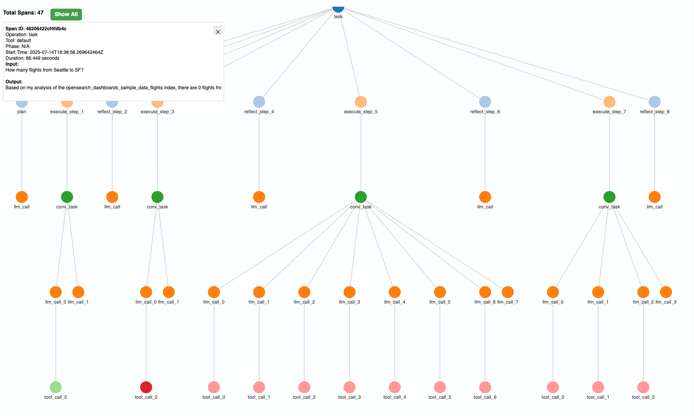

# Setting Up Agent Tracing and Visualization in OpenSearch

This tutorial explains how to configure and set up agent tracing and visualization in OpenSearch using OpenTelemetry, Data Prepper, and the OpenTelemetry Collector.


## Prerequisites
- Docker and Docker Compose installed
- Basic understanding of OpenSearch and OpenTelemetry concepts

**⚠️ Security Note**: This tutorial uses `ssl: false` configurations throughout for development convenience. These settings are **NOT recommended for production environments**. For production deployments, you should configure proper TLS certificates and authentication mechanisms.


## 1. Configuration Setup

### Create Configuration Directory
```bash
mkdir opensearch-tracing
cd opensearch-tracing
```

### Create Configuration Files
Create the following configuration files in your directory:
- [`docker-compose.yml`](docker-compose.yml): Defines the services
- [`otel-collector-config.yaml`](otel-collector-config.yaml): Configures the OpenTelemetry collector
- [`pipelines.yaml`](pipelines.yaml): Configures Data Prepper pipelines
- [`data-prepper-config.yaml`](data-prepper-config.yaml): Basic Data Prepper configuration
- [`ml_agent_trace.json`](ml_agent_trace.json): Custom index mapping for agent traces


## 2. Docker Compose File Setup

The [`docker-compose.yml`](docker-compose.yml) file orchestrates all the services required for agent tracing and visualization, including OpenSearch, OpenSearch Dashboards, Data Prepper, and the OpenTelemetry Collector.

**⚠️ Development Configuration**: The configuration files in this tutorial use `ssl: false` and basic authentication for development simplicity. For production use, you must configure proper TLS certificates and security settings.

### Key Points
- **Version Consistency:**
  - Ensure all OpenSearch services use the same version (e.g., 3.1.0 for OpenSearch, Dashboards, and plugins)
  - Version mismatches can cause compatibility issues and unexpected behavior
- **Volume Mounts:**
  - Data Prepper expects its configuration files to be mounted directly to `/usr/share/data-prepper/config/data-prepper-config.yaml` and `/usr/share/data-prepper/pipelines/pipelines.yaml` inside the container.
  - Incorrect mount paths (such as mounting into subdirectories) will cause Data Prepper to fail to start.
- **Environment Variables:**
  - For OpenSearch, ensure the following environment variables are set to enable tracing features:
    - `opensearch.experimental.feature.telemetry.enabled=true`
    - `telemetry.feature.tracer.enabled=true`
    - `telemetry.tracer.enabled=true`
    - `telemetry.tracer.sampler.probability=1.0`
    - `telemetry.otel.tracer.span.exporter.class=io.opentelemetry.exporter.otlp.trace.OtlpGrpcSpanExporter`
    - `plugins.ml_commons.tracing_enabled=true`
    - `plugins.ml_commons.agent_tracing_enabled=true`

### Configuration Details
The Docker Compose file includes:
- **OpenSearch Node**: Configured with telemetry features enabled
- **OpenSearch Dashboards**: For trace visualization
- **Data Prepper**: For trace processing and storage
- **OpenTelemetry Collector**: For trace collection and forwarding

**Note:**
- Adjust the file paths on the left side of the `volumes` section to match your actual directory structure.
- The above example assumes you are running `docker-compose` from the directory containing your config files.
- The environment variables for OpenSearch are critical for enabling agent tracing features.


## 3. Configure OpenTelemetry Collector

The OpenTelemetry Collector receives traces from OpenSearch agents and forwards them to Data Prepper.

The [`otel-collector-config.yaml`](otel-collector-config.yaml) file configures:
- **Receivers**: OTLP gRPC and HTTP endpoints
- **Processors**: Trace filtering and batching
- **Exporters**: Debug output and Data Prepper forwarding
- **Service Pipelines**: Trace processing pipeline


## 4. Configure Data Prepper

Data Prepper processes and transforms the traces before sending them to OpenSearch.

### Pipeline Configuration
The [`pipelines.yaml`](pipelines.yaml) file defines:
- **Entry Pipeline**: Receives traces from OpenTelemetry Collector
- **Raw Trace Pipeline**: Processes and stores traces in OpenSearch
- **Service Map Pipeline**: Creates service dependency maps

### Data Prepper Configuration
The [`data-prepper-config.yaml`](data-prepper-config.yaml) file contains basic configuration settings.


## 5. Index Mapping Configuration

### Custom Index Mapping File

The [`ml_agent_trace.json`](ml_agent_trace.json) file contains the custom index mapping for agent traces and connector traces. This file defines the structure and field types for the `otel-v1-apm-span-agent` index where your agent traces will be stored.

#### Important Notes

- **File Location**: The file must be mounted at `/usr/share/data-prepper/ml_agent_trace.json` inside the Data Prepper container
- **Template Reference**: The `pipelines.yaml` references this file in the `template_file` field
- **Index Creation**: Data Prepper will use this template to create the `otel-v1-apm-span-agent` index with the proper mapping
- **Field Compatibility**: Ensure your custom mapping includes all required fields for proper trace visualization in OpenSearch Dashboards


## 6. Start the Services

Start all services:
```bash
docker-compose up -d
```

**Note 1: Initial Connection Warnings**
When Data Prepper starts, you may see connection warnings like this:
```
[raw-trace-pipeline-sink-worker-4-thread-1] WARN  org.opensearch.dataprepper.plugins.sink.opensearch.OpenSearchSink - Failed to initialize OpenSearch sink, retrying: Connection refused
```

This is normal behavior. Data Prepper needs to wait for the OpenSearch cluster to be fully up and running. Eventually, you should see this success message:
```
[entry-pipeline-sink-worker-2-thread-1] INFO  org.opensearch.dataprepper.plugins.source.oteltrace.OTelTraceSource - Started otel_trace_source on port 21890...
```

**Note 2: Expected Error Logs**
You may see error logs like this in Data Prepper:
```
[raw-trace-pipeline-processor-worker-3-thread-1] ERROR org.opensearch.dataprepper.plugins.processor.oteltracegroup.OTelTraceGroupProcessor - Search request for traceGroup failed for traceIds: [] due to OpenSearch exception [type=index_not_found_exception, reason=no such index [otel-v1-apm-span]]
```

These errors are expected and can be safely ignored. They occur because we're using custom static mappings instead of the default Data Prepper index mappings. The system will work correctly despite these warnings.

Verify services are running:
```bash
docker-compose ps
```


## 7. Enable/Disable Agent Tracing at Runtime

You can enable or disable agent tracing and connector tracing at runtime using the OpenSearch cluster settings API:

```bash
curl -X PUT "localhost:9200/_cluster/settings" -H 'Content-Type: application/json' -d'
{
  "persistent": {
    "plugins.ml_commons.agent_tracing_enabled": true,
    "plugins.ml_commons.connector_tracing_enabled": true,
    "plugins.ml_commons.model_tracing_enabled": true
  }
}'
```
Note: The `plugins.ml_commons.agent_tracing_enabled` setting only takes effect if the static setting `plugins.ml_commons.tracing_enabled` is already enabled in your OpenSearch configuration.

Use this API to turn agent tracing on or off without restarting your cluster, as long as tracing is enabled globally.


## 8. View Traces

- Open OpenSearch Dashboards at [http://localhost:5601](http://localhost:5601)
- Navigate to **Observability → Traces**
- You should see agent traces around ~3-5 minutes after agent execution


## 9. Understanding the Visualizations

The traces visualization provides several main views to help you analyze and understand your trace data:

### Table View

*Table View: This view displays each span as a row in a table, with columns such as Span ID, Trace ID, Parent Span ID, Duration, and Status. It allows you to include and exclude different columns as well. Shown above is a customization that might be useful for agent trace understanding. The columns include `Span ID`, `Duration (ms)`, `span.attributes.gen_ai@operation@name`, `span.attributes.gen_ai@usage@total_tokens`, `span.attributes.gen_ai@agent@task`, and `span.attributes.gen_ai@agent@result`.*

After clicking into one specific trace (agent execution) you arrive at the Trace Analytics visualizations shown below.

### Timeline/List View

*Timeline/Waterfall View: The timeline or waterfall view presents traces in chronological order, showing the sequence of spans as they occurred. Each entry is also clickable which creates a pop-up of all the information stored within that span.*

### Hierarchical List View

*Hierarchical Tree View: This view organizes spans in a tree-like structure, reflecting the parent-child relationships between operations. It helps you visualize the call hierarchy and understand how different services and components interact within a trace.*

---

### Vega Visualization: Trace Graph

In addition to Trace Analytics, OpenSearch Dashboards also supports [Vega](https://vega.github.io/vega/) visualizations for advanced, custom graphing. You can use Vega to create interactive graphs of your trace data, such as service dependency graphs or span relationships.

The [`trace-graph-vega.json`](trace-graph-vega.json) file contains a Vega specification for creating trace graphs. Simply copy this file into the Vega editor in OpenSearch Dashboards and change the `traceId` to be the traceId of the run that was just executed.

> **How to use:**
> 1. Go to **OpenSearch Dashboards → Visualize → Create visualization → Vega**.
> 2. Paste the Vega spec from [`trace-graph-vega.json`](trace-graph-vega.json) into the editor.
> 3. Adjust the data and layout as needed for your trace data.


*Vega Graph View: This custom graph visualization shows the relationships between services and spans in your trace data, helping you understand dependencies and flow at a glance.*


## 10. Setup Notes for Non-Docker Environments

If you're setting up agent tracing in a production environment without Docker Compose, consider these important notes:

### 1. Install the Telemetry-OTEL Plugin

Ensure the telemetry-OTEL plugin is installed in your OpenSearch instance:

```bash
# For OpenSearch 3.1.0
bin/opensearch-plugin install telemetry-otel
```

### 2. Configuration Format Differences

When using configuration files instead of environment variables, note that some settings use colons (`:`) instead of equals (`=`):

**Environment Variables (Docker):**
```yaml
environment:
  - opensearch.experimental.feature.telemetry.enabled=true
  - telemetry.feature.tracer.enabled=true
  - telemetry.tracer.enabled=true
  - telemetry.tracer.sampler.probability=1.0
  - telemetry.otel.tracer.span.exporter.class=io.opentelemetry.exporter.otlp.trace.OtlpGrpcSpanExporter
  - plugins.ml_commons.tracing_enabled=true
  - plugins.ml_commons.agent_tracing_enabled=true
```

**Configuration Files (Non-Docker):**
```yaml
opensearch.experimental.feature.telemetry.enabled: true
telemetry.feature.tracer.enabled: true
telemetry.tracer.enabled: true
telemetry.tracer.sampler.probability: 1.0
telemetry.otel.tracer.span.exporter.class: io.opentelemetry.exporter.otlp.trace.OtlpGrpcSpanExporter
plugins.ml_commons.tracing_enabled: true
plugins.ml_commons.agent_tracing_enabled: true

```

### 3. OpenTelemetry Collector Installation and Setup

For non-Docker setups, you need to install and configure the OpenTelemetry Collector:

#### Download and Install OpenTelemetry Collector
```bash
# Download the latest OpenTelemetry Collector
wget https://github.com/open-telemetry/opentelemetry-collector-releases/releases/download/v0.131.1/otelcol-contrib_0.131.1_linux_amd64.tar.gz

# Extract the archive
tar -xzf otelcol-contrib_linux_amd64.tar.gz

# Move to system path and make executable
sudo mv otelcol-contrib /usr/local/bin/
sudo chmod +x /usr/local/bin/otelcol-contrib

# Create configuration directory
mkdir -p ~/otel-collector
cd ~/otel-collector
```

#### Create OpenTelemetry Collector Configuration
```bash
cat > otel-collector-config.yaml << 'EOF'
receivers:
  otlp:
    protocols:
      grpc:
        endpoint: 0.0.0.0:4317
      http:
        endpoint: 0.0.0.0:4318

processors:
  filter/traces:
    spans:
      include:
        match_type: regexp
        attributes:
          - key: service.type
            value: tracer
  batch/traces:
    timeout: 5s
    send_batch_size: 50

exporters:
  debug:
    verbosity: detailed
  otlp/data-prepper:
    endpoint: localhost:21890
    tls:
      insecure: true

service:
  pipelines:
    traces:
      receivers: [otlp]
      processors: [filter/traces, batch/traces]
      exporters: [debug, otlp/data-prepper]
EOF
```

#### Run OpenTelemetry Collector
```bash
otelcol-contrib --config=~/otel-collector/otel-collector-config.yaml
```

### 4. Configuration File Locations

For non-Docker setups, you'll need to place configuration files in specific locations:

#### Data Prepper Configuration Files
- **Main Config**: [`data-prepper-config.yaml`](data-prepper-config.yaml)
- **Location**: `/usr/share/data-prepper/config/data-prepper-config.yaml`
- **Pipelines Config**: [`pipelines.yaml`](pipelines.yaml)
- **Location**: `/usr/share/data-prepper/pipelines/pipelines.yaml`
- **Index Mapping**: [`ml_agent_trace.json`](ml_agent_trace.json)
- **Location**: `/usr/share/data-prepper/ml_agent_trace.json`

### 4. Startup Order

**Critical**: The components must be started in the following order to ensure proper initialization:

1. **Data Prepper** - Start first to ensure the trace processing pipeline is ready
2. **OpenTelemetry Collector** - Start after Data Prepper to establish the trace forwarding connection
3. **OpenSearch Cluster** - Start after both Data Prepper and Collector are running
4. **OpenSearch Dashboards** - Start last after the cluster is fully operational

**Important Note**: Data Prepper also depends on the OpenSearch cluster to be running, as it needs to write processed traces to OpenSearch indices. This is why Data Prepper is configured with `restart: unless-stopped` in the Docker Compose file - it will automatically restart and retry connections until OpenSearch is available.

## Troubleshooting

If traces aren't appearing:
- Check OpenTelemetry Collector logs: `docker-compose logs otel-collector`
- Check Data Prepper logs: `docker-compose logs data-prepper`
- Verify index creation: `curl localhost:9200/_cat/indices`
- Verify index tempate: `curl localhost:9200/_index_template`

**Common issues:**
- Incorrect endpoint configurations
- Missing permissions
- Disabled tracing settings

---

## Additional Notes
- Traces are stored in the `otel-v1-apm-span-agent` index
- The sampling rate is set to 100% (`1.0`) for development
- For production, consider adjusting sampling rate and buffer sizes

---

## References
- [OpenSearch Observability documentation](https://opensearch.org/docs/latest/observing-your-data/)
- [OpenTelemetry documentation](https://opentelemetry.io/docs/)
- [Data Prepper documentation](https://opensearch.org/docs/latest/data-prepper/) 