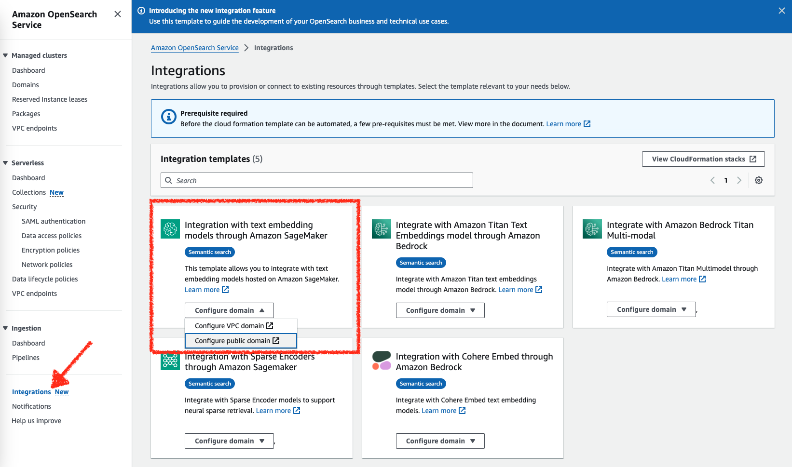
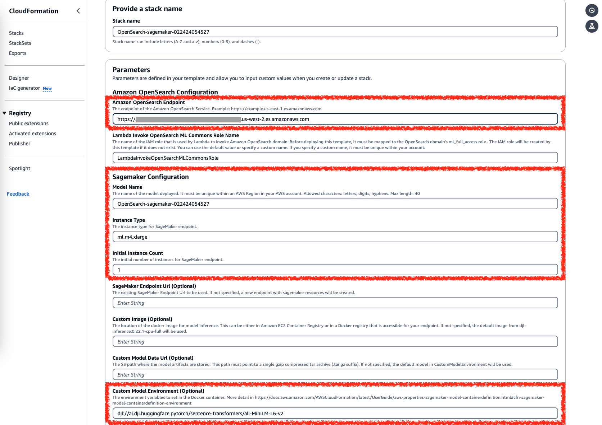
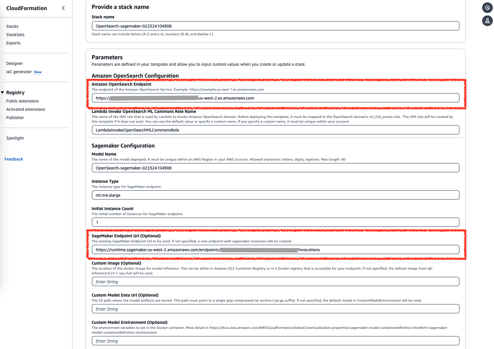

# Topic

This doc describes how to build semantic search in Amazon-managed OpenSearch service with [AWS CloudFormation](https://docs.aws.amazon.com/opensearch-service/latest/developerguide/cfn-template.html) and SageMaker.
If you are not using Amazon OpenSearch, refer to [sagemaker_connector_blueprint](https://github.com/opensearch-project/ml-commons/blob/main/docs/remote_inference_blueprints/sagemaker_connector_blueprint.md) and [OpenSearch semantic search](https://opensearch.org/docs/latest/search-plugins/semantic-search/).

The CloudFormation integration automates the manual process described in the [semantic_search_with_sagemaker_embedding_model tutorial](https://github.com/opensearch-project/ml-commons/blob/2.x/docs/tutorials/aws/semantic_search_with_sagemaker_embedding_model.md).

The CloudFormation template creates an IAM role and then uses a Lambda function to create an AI connector and model.

Make sure your SageMaker model inputs follow the format that the [default pre-processing function](https://opensearch.org/docs/latest/ml-commons-plugin/remote-models/blueprints/#preprocessing-function) requires. The model input must be an array of strings. 
```
["hello world", "how are you"]
```
Additionally, make sure the model output follows the format that the [default post-processing function](https://opensearch.org/docs/latest/ml-commons-plugin/remote-models/blueprints/#post-processing-function) requires. The model output must be an array of arrays, where each array corresponds to the embedding of an input string.
```
[
  [
    -0.048237994,
    -0.07612697,
    ...
  ],
  [
    0.32621247,
    0.02328475,
    ...
  ]
]
```

If your model input/output is not the same as the required default, you can build your own pre/post-processing function using a [Painless script](https://opensearch.org/docs/latest/api-reference/script-apis/exec-script/).

For example, the Amazon Bedrock Titan embedding model ([blueprint](https://github.com/opensearch-project/ml-commons/blob/2.x/docs/remote_inference_blueprints/bedrock_connector_titan_embedding_blueprint.md#2-create-connector-for-amazon-bedrock)) input is 
```
{ "inputText": "your_input_text" }
```
The Neural Search plugin will sends the model input to ml-commons as follows:
```
{ "text_docs": [ "your_input_text1", "your_input_text2"] }
```
Thus, you need to build a pre-processing function to transform `text_docs` into `inputText`:
```
"pre_process_function": """
    StringBuilder builder = new StringBuilder();
    builder.append("\"");
    String first = params.text_docs[0];// Get the first doc, ml-commons will iterate all docs
    builder.append(first);
    builder.append("\"");
    def parameters = "{" +"\"inputText\":" + builder + "}"; // This is the Bedrock Titan embedding model input
    return  "{" +"\"parameters\":" + parameters + "}";"""
```

The default Amazon Bedrock Titan embedding model output has the following format:
```
{
  "embedding": <float_array>
}
```
However, the Neural Search plugin expects the following format:
```
{
  "name": "sentence_embedding",
  "data_type": "FLOAT32",
  "shape": [ <embedding_size> ],
  "data": <float_array>
}
```
Similarly, you need to build a post-processing function to transform the Bedrock Titan embedding model output into a format that the Neural Search plugin requires:

```
"post_process_function": """
      def name = "sentence_embedding";
      def dataType = "FLOAT32";
      if (params.embedding == null || params.embedding.length == 0) {
        return params.message;
      }
      def shape = [params.embedding.length];
      def json = "{" +
                 "\"name\":\"" + name + "\"," +
                 "\"data_type\":\"" + dataType + "\"," +
                 "\"shape\":" + shape + "," +
                 "\"data\":" + params.embedding +
                 "}";
      return json;
    """
```

Note: Replace the placeholders that start with the prefix `your_` with your own values.

# Steps

## 0. Create an OpenSearch cluster

Go to the AWS OpenSearch console UI and create an OpenSearch domain.

Note the domain ARN; you'll use it in the next step.

## 1. Map backend role

AWS OpenSearch Integration CloudFormation template will use a Lambda function to create an AI connector with an IAM role. You need to 
map the IAM role to `ml_full_access` to grant it the required permissions. 
Refer to [semantic_search_with_sagemaker_embedding_model#map-backend-role](https://github.com/opensearch-project/ml-commons/blob/2.x/docs/tutorials/aws/semantic_search_with_sagemaker_embedding_model.md#22-map-backend-role). 

You can find the IAM role in the `Lambda Invoke OpenSearch ML Commons Role Name` field in the CloudFormation template (see the screenshot in step 2.1).

The default IAM role is `LambdaInvokeOpenSearchMLCommonsRole`, so you need to map the `arn:aws:iam::your_aws_account_id:role/LambdaInvokeOpenSearchMLCommonsRole` backend role  to `ml_full_access`.

For a quick start, you can also map all roles to `ml_full_access` using a wildcard `arn:aws:iam::your_aws_account_id:role/*`

Because `all_access` has more permissions than `ml_full_access`, it's OK to map the backend role to `all_access`.


## 2. Run CloudFormation template

You can find CloudFormation template integration in the AWS OpenSearch console.



For all options below, you can find the OpenSearch AI connector and model IDs in the CloudFormation stack `Outputs` when it completes.

If you see any failure, you can find the log in the SageMaker Console by searching for `Log Groups` with the CloudFormation stack name.

### 2.1 Option 1: Deploy pretrained model to SageMaker

You can deploy a pretrained Huggingface sentence-transformer embedding model from the [DJL](https://djl.ai/) model repo.

Fill out the following fields as described. Keep the default values for all fields not mentioned below:

1. You must fill your `Amazon OpenSearch Endpoint`.
2. You can use the default setting of the `Sagemaker Configuration` field for a quick start. If necessary, you can change these values. For all supported SageMaker instance types, see [SageMaker documentation](https://aws.amazon.com/sagemaker/pricing/).
3. You must leave the `SageMaker Endpoint Url` empty. If you input a URL in this field, you will not deploy the model to SageMaker to create a new inference endpoint.
4. You can leave the `Custom Image` field empty. The default is `djl-inference:0.22.1-cpu-full`. For all available images, see [this document](https://docs.aws.amazon.com/deep-learning-containers/latest/devguide/deep-learning-containers-images.html).
5. You must leave the `Custom Model Data Url` empty.
6. The default value of `Custom Model Environment` is `djl://ai.djl.huggingface.pytorch/sentence-transformers/all-MiniLM-L6-v2`. For all supported models see the [Appendix](#appendix).




### 2.2 Option 2: Create model with your existing Sagemaker inference endpoint

If you already have a SageMaker inference endpoint, you can create a remote model directly using this endpoint.

Fill out the following fields as described. Keep the default values for all fields not mentioned below:
1. You must fill your `Amazon OpenSearch Endpoint`.
2. You must fill your `SageMaker Endpoint Url`.
3. You must leave `Custom Image`, `Custom Model Data Url`, and `Custom Model Environment` empty.




# Appendix
## Huggingface sentence-transformer embedding models available in DJL model repo
```
djl://ai.djl.huggingface.pytorch/sentence-transformers/LaBSE/
djl://ai.djl.huggingface.pytorch/sentence-transformers/all-MiniLM-L12-v1/
djl://ai.djl.huggingface.pytorch/sentence-transformers/all-MiniLM-L12-v2/
djl://ai.djl.huggingface.pytorch/sentence-transformers/all-MiniLM-L6-v1/
djl://ai.djl.huggingface.pytorch/sentence-transformers/all-MiniLM-L6-v2/
djl://ai.djl.huggingface.pytorch/sentence-transformers/all-distilroberta-v1/
djl://ai.djl.huggingface.pytorch/sentence-transformers/all-mpnet-base-v1/
djl://ai.djl.huggingface.pytorch/sentence-transformers/all-mpnet-base-v2/
djl://ai.djl.huggingface.pytorch/sentence-transformers/all-roberta-large-v1/
djl://ai.djl.huggingface.pytorch/sentence-transformers/allenai-specter/
djl://ai.djl.huggingface.pytorch/sentence-transformers/bert-base-nli-cls-token/
djl://ai.djl.huggingface.pytorch/sentence-transformers/bert-base-nli-max-tokens/
djl://ai.djl.huggingface.pytorch/sentence-transformers/bert-base-nli-mean-tokens/
djl://ai.djl.huggingface.pytorch/sentence-transformers/bert-base-nli-stsb-mean-tokens/
djl://ai.djl.huggingface.pytorch/sentence-transformers/bert-base-wikipedia-sections-mean-tokens/
djl://ai.djl.huggingface.pytorch/sentence-transformers/bert-large-nli-cls-token/
djl://ai.djl.huggingface.pytorch/sentence-transformers/bert-large-nli-max-tokens/
djl://ai.djl.huggingface.pytorch/sentence-transformers/bert-large-nli-mean-tokens/
djl://ai.djl.huggingface.pytorch/sentence-transformers/bert-large-nli-stsb-mean-tokens/
djl://ai.djl.huggingface.pytorch/sentence-transformers/clip-ViT-B-32-multilingual-v1/
djl://ai.djl.huggingface.pytorch/sentence-transformers/distilbert-base-nli-mean-tokens/
djl://ai.djl.huggingface.pytorch/sentence-transformers/distilbert-base-nli-stsb-mean-tokens/
djl://ai.djl.huggingface.pytorch/sentence-transformers/distilbert-base-nli-stsb-quora-ranking/
djl://ai.djl.huggingface.pytorch/sentence-transformers/distilbert-multilingual-nli-stsb-quora-ranking/
djl://ai.djl.huggingface.pytorch/sentence-transformers/distiluse-base-multilingual-cased-v1/
djl://ai.djl.huggingface.pytorch/sentence-transformers/facebook-dpr-ctx_encoder-multiset-base/
djl://ai.djl.huggingface.pytorch/sentence-transformers/facebook-dpr-ctx_encoder-single-nq-base/
djl://ai.djl.huggingface.pytorch/sentence-transformers/facebook-dpr-question_encoder-multiset-base/
djl://ai.djl.huggingface.pytorch/sentence-transformers/facebook-dpr-question_encoder-single-nq-base/
djl://ai.djl.huggingface.pytorch/sentence-transformers/msmarco-MiniLM-L-12-v3/
djl://ai.djl.huggingface.pytorch/sentence-transformers/msmarco-MiniLM-L-6-v3/
djl://ai.djl.huggingface.pytorch/sentence-transformers/msmarco-MiniLM-L12-cos-v5/
djl://ai.djl.huggingface.pytorch/sentence-transformers/msmarco-MiniLM-L6-cos-v5/
djl://ai.djl.huggingface.pytorch/sentence-transformers/msmarco-bert-base-dot-v5/
djl://ai.djl.huggingface.pytorch/sentence-transformers/msmarco-bert-co-condensor/
djl://ai.djl.huggingface.pytorch/sentence-transformers/msmarco-distilbert-base-dot-prod-v3/
djl://ai.djl.huggingface.pytorch/sentence-transformers/msmarco-distilbert-base-tas-b/
djl://ai.djl.huggingface.pytorch/sentence-transformers/msmarco-distilbert-base-v2/
djl://ai.djl.huggingface.pytorch/sentence-transformers/msmarco-distilbert-base-v3/
djl://ai.djl.huggingface.pytorch/sentence-transformers/msmarco-distilbert-base-v4/
djl://ai.djl.huggingface.pytorch/sentence-transformers/msmarco-distilbert-cos-v5/
djl://ai.djl.huggingface.pytorch/sentence-transformers/msmarco-distilbert-dot-v5/
djl://ai.djl.huggingface.pytorch/sentence-transformers/msmarco-distilbert-multilingual-en-de-v2-tmp-lng-aligned/
djl://ai.djl.huggingface.pytorch/sentence-transformers/msmarco-distilbert-multilingual-en-de-v2-tmp-trained-scratch/
djl://ai.djl.huggingface.pytorch/sentence-transformers/msmarco-distilroberta-base-v2/
djl://ai.djl.huggingface.pytorch/sentence-transformers/msmarco-roberta-base-ance-firstp/
djl://ai.djl.huggingface.pytorch/sentence-transformers/msmarco-roberta-base-v2/
djl://ai.djl.huggingface.pytorch/sentence-transformers/msmarco-roberta-base-v3/
djl://ai.djl.huggingface.pytorch/sentence-transformers/multi-qa-MiniLM-L6-cos-v1/
djl://ai.djl.huggingface.pytorch/sentence-transformers/multi-qa-MiniLM-L6-dot-v1/
djl://ai.djl.huggingface.pytorch/sentence-transformers/multi-qa-distilbert-cos-v1/
djl://ai.djl.huggingface.pytorch/sentence-transformers/multi-qa-distilbert-dot-v1/
djl://ai.djl.huggingface.pytorch/sentence-transformers/nli-bert-base/
djl://ai.djl.huggingface.pytorch/sentence-transformers/nli-bert-large-max-pooling/
djl://ai.djl.huggingface.pytorch/sentence-transformers/nli-distilbert-base/
djl://ai.djl.huggingface.pytorch/sentence-transformers/nli-distilroberta-base-v2/
djl://ai.djl.huggingface.pytorch/sentence-transformers/nli-roberta-base-v2/
djl://ai.djl.huggingface.pytorch/sentence-transformers/nli-roberta-large/
djl://ai.djl.huggingface.pytorch/sentence-transformers/nq-distilbert-base-v1/
djl://ai.djl.huggingface.pytorch/sentence-transformers/paraphrase-MiniLM-L12-v2/
djl://ai.djl.huggingface.pytorch/sentence-transformers/paraphrase-MiniLM-L3-v2/
djl://ai.djl.huggingface.pytorch/sentence-transformers/paraphrase-MiniLM-L6-v2/
djl://ai.djl.huggingface.pytorch/sentence-transformers/paraphrase-TinyBERT-L6-v2/
djl://ai.djl.huggingface.pytorch/sentence-transformers/paraphrase-albert-base-v2/
djl://ai.djl.huggingface.pytorch/sentence-transformers/paraphrase-albert-small-v2/
djl://ai.djl.huggingface.pytorch/sentence-transformers/paraphrase-distilroberta-base-v2/
djl://ai.djl.huggingface.pytorch/sentence-transformers/paraphrase-multilingual-MiniLM-L12-v2/
djl://ai.djl.huggingface.pytorch/sentence-transformers/paraphrase-multilingual-mpnet-base-v2/
djl://ai.djl.huggingface.pytorch/sentence-transformers/paraphrase-xlm-r-multilingual-v1/
djl://ai.djl.huggingface.pytorch/sentence-transformers/quora-distilbert-base/
djl://ai.djl.huggingface.pytorch/sentence-transformers/quora-distilbert-multilingual/
djl://ai.djl.huggingface.pytorch/sentence-transformers/roberta-base-nli-mean-tokens/
djl://ai.djl.huggingface.pytorch/sentence-transformers/roberta-base-nli-stsb-mean-tokens/
djl://ai.djl.huggingface.pytorch/sentence-transformers/roberta-large-nli-mean-tokens/
djl://ai.djl.huggingface.pytorch/sentence-transformers/roberta-large-nli-stsb-mean-tokens/
djl://ai.djl.huggingface.pytorch/sentence-transformers/stsb-bert-base/
djl://ai.djl.huggingface.pytorch/sentence-transformers/stsb-bert-large/
djl://ai.djl.huggingface.pytorch/sentence-transformers/stsb-distilbert-base/
djl://ai.djl.huggingface.pytorch/sentence-transformers/stsb-distilroberta-base-v2/
djl://ai.djl.huggingface.pytorch/sentence-transformers/stsb-roberta-base-v2/
djl://ai.djl.huggingface.pytorch/sentence-transformers/stsb-roberta-base/
djl://ai.djl.huggingface.pytorch/sentence-transformers/stsb-roberta-large/
djl://ai.djl.huggingface.pytorch/sentence-transformers/stsb-xlm-r-multilingual/
djl://ai.djl.huggingface.pytorch/sentence-transformers/use-cmlm-multilingual/
djl://ai.djl.huggingface.pytorch/sentence-transformers/xlm-r-100langs-bert-base-nli-stsb-mean-tokens/
djl://ai.djl.huggingface.pytorch/sentence-transformers/xlm-r-bert-base-nli-stsb-mean-tokens/
djl://ai.djl.huggingface.pytorch/sentence-transformers/xlm-r-distilroberta-base-paraphrase-v1/
```