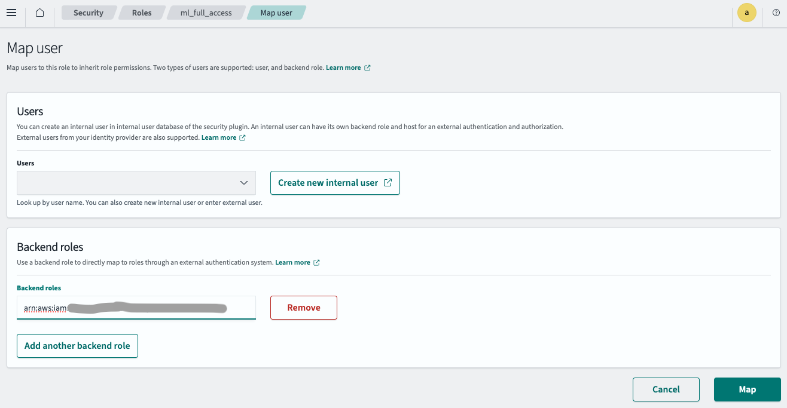

# Topic


The [by field rerank type](https://opensearch.org/docs/latest/search-plugins/search-pipelines/rerank-processor/#the-by_field-rerank-type) is a feature released in OpenSearch 2.18.
It takes results from a search hit and resorts your search hits based on designated field. This is useful when your documents have a field that is important, or when you have results
from a remote model and wish to rerank them using it.

This tutorial explains how to use the [Cohere Rerank](https://docs.cohere.com/reference/rerank-1) model invoked by the ML Inference processor With the By Field rerank type.
to achieve a similar workflow that of the [Reranking pipeline](https://opensearch.org/docs/latest/search-plugins/search-relevance/reranking-search-results/).

Note: Replace the placeholders that start with `your_` with your own values.

# Steps to connect the Cohere model with OpenSearch

# 1. Create the Connector
Based on your platform there are extra steps if you choose to use Amazon OpenSearch or OpenSearch Locally to create a connector.
If using Amazon OpenSearch make sure to follow the steps in the order provided [below](#b-using-opensearch-locally)

Regardless of the platform you decide to use the outcome will result in a `connector_id` which will be for model registration.

## A. Using Amazon OpenSearch
### 0. Create OpenSearch cluster

Go to AWS OpenSearch console UI and create OpenSearch domain.

Copy the domain ARN which will be used in later steps.

### 1. Create secret
Store your Cohere API key in Secret Manager.

Use default value if not mentioned.

1. Choose "Other type of secret" type.
2. Create a "my_cohere_key" key pais with your Cohere API key as value.
3. On next page, input `my_test_cohere_secret` as secret name

Copy the secret ARN which will be used in later steps.

### 2. Create IAM role
To use the secret created in Step1, we need to create an IAM role with read secret permission.
This IAM role will be configured in connector. Connector will use this role to read secret.

Go to IAM console, create IAM role `my_cohere_secret_role` with:

- Custom trust policy:
```
{
    "Version": "2012-10-17",
    "Statement": [
        {
            "Effect": "Allow",
            "Principal": {
                "Service": "es.amazonaws.com"
            },
            "Action": "sts:AssumeRole"
        }
    ]
}
```
- Permission
```
{
    "Version": "2012-10-17",
    "Statement": [
        {
            "Action": [
                "secretsmanager:GetSecretValue",
                "secretsmanager:DescribeSecret"
            ],
            "Effect": "Allow",
            "Resource": "your_secret_arn_created_in_step1"
        }
    ]
}
```

Copy the role ARN which will be used in later steps.

### 3. Configure IAM role in OpenSearch

#### 3.1 Create IAM role for Signing create connector request

Generate a new IAM role specifically for signing your create connector request.


Create IAM role `my_create_connector_role` with
- Custom trust policy. Note: `your_iam_user_arn` is the IAM user which will run `aws sts assume-role` in step 4.1
```
{
    "Version": "2012-10-17",
    "Statement": [
        {
            "Effect": "Allow",
            "Principal": {
                "AWS": "your_iam_user_arn"
            },
            "Action": "sts:AssumeRole"
        }
    ]
}
```
- permission
```
{
    "Version": "2012-10-17",
    "Statement": [
        {
            "Effect": "Allow",
            "Action": "iam:PassRole",
            "Resource": "your_iam_role_arn_created_in_step2"
        },
        {
            "Effect": "Allow",
            "Action": "es:ESHttpPost",
            "Resource": "your_opensearch_domain_arn_created_in_step0"
        }
    ]
}
```

Copy this role ARN which will be used in later steps.

#### 3.2 Map backend role

1. Log in to your OpenSearch Dashboard and navigate to the "Security" page, which you can find in the left-hand menu.
2. Then click "Roles" on security page (you can find it on left-hand), then find "ml_full_access" role and click it.
3. On "ml_full_access" role detail page, click "Mapped users", then click "Manage mapping". Paste IAM role ARN created in Step 3.1 to backend roles part.
   Click "Map", then the IAM role configured successfully in your OpenSearch cluster.



#### 4 Get temporary credential of the role created in step 3.1:
```
aws sts assume-role --role-arn your_iam_role_arn_created_in_step3.1 --role-session-name your_session_name
```

Configure the temporary credential in `~/.aws/credentials` like this

```
[default]
AWS_ACCESS_KEY_ID=your_access_key_of_role_created_in_step3.1
AWS_SECRET_ACCESS_KEY=your_secret_key_of_role_created_in_step3.1
AWS_SESSION_TOKEN=your_session_token_of_role_created_in_step3.1
```
These credentials allow you to create the connector securely

### 5 Create connector

Run this python code with the temporary credential configured in `~/.aws/credentials`

```
import boto3
import requests 
from requests_aws4auth import AWS4Auth

host = 'your_amazon_opensearch_domain_endpoint_created_in_step0'
region = 'your_amazon_opensearch_domain_region'
service = 'es'

credentials = boto3.Session().get_credentials()
awsauth = AWS4Auth(credentials.access_key, credentials.secret_key, region, service, session_token=credentials.token)

path = '/_plugins/_ml/connectors/_create'
url = host + path

payload = {
    "name": "cohere-rerank",
    "description": "The connector to Cohere reanker model",
    "version": "1",
    "protocol": "http",
    "credential": {
        "secretArn": "your_secret_arn_created_in_step1",
        "roleArn": "your_iam_role_arn_created_in_step2"
    },
    "parameters": {
        "model": "rerank-english-v3.0",
        "return_documents": true

    },
    "actions": [
        {
            "action_type": "predict",
            "method": "POST",
            "url": "https://api.cohere.ai/v1/rerank",
            "headers": {
                "Authorization": "Bearer ${credential.secretArn.my_cohere_key}"
            },
            "request_body": "{ \"documents\": ${parameters.documents}, \"query\": \"${parameters.query}\", \"model\": \"${parameters.model}\", \"top_n\": ${parameters.top_n}, \"return_documents\": ${parameters.return_documents} }"
        }
    ]
}

headers = {"Content-Type": "application/json"}

r = requests.post(url, auth=awsauth, json=payload, headers=headers)
print(r.text)
```
The script will output connector id.

sample output
```
{"connector_id":"qp2QP40BWbTmLN9Fpo40"}
```

copy the connector_id as it will be used in later steps.

## B. Using OpenSearch locally
```
POST /_plugins/_ml/connectors/_create
{
    "name": "cohere-rerank",
    "description": "The connector to Cohere reanker model",
    "version": "1",
    "protocol": "http",
    "credential": {
        "cohere_key": "your_cohere_api_key"
    },
    "parameters": {
        "model": "rerank-english-v3.0",
        "return_documents": true
    },
    "actions": [
        {
            "action_type": "predict",
            "method": "POST",
            "url": "https://api.cohere.ai/v1/rerank",
            "headers": {
                "Authorization": "Bearer ${credential.cohere_key}"
            },
            "request_body": "{ \"documents\": ${parameters.documents}, \"query\": \"${parameters.query}\", \"model\": \"${parameters.model}\", \"top_n\": ${parameters.top_n},  \"return_documents\": ${parameters.return_documents} }"
        }
    ]
}
```

sample output
```
{"connector_id":"qp2QP40BWbTmLN9Fpo40"}
```

copy the connector_id as it will be used in later steps.

## 2. Register the Cohere Rerank model

Use the connector ID from step 1 to create a model:
```
POST /_plugins/_ml/models/_register?deploy=true
{
    "name": "cohere rerank model",
    "function_name": "remote",
    "description": "test rerank model",
    "connector_id": "your_connector_id"
}
```
The model id will be used in future steps

# 3. Test the remote model
You can now run prediction on the model like so.
```
POST /_plugins/_ml/models/your_model_id/_predict
{
  "parameters": {
	"top_n" : 100,
    "query": "What day is it?",
	"documents" : ["Monday", "Tuesday", "apples"]
  }
}

```
which has the following response
```json
{
	"inference_results": [
		{
			"output": [
				{
					"name": "response",
					"dataAsMap": {
						"id": "e15a3922-3d89-4adc-96cf-9b85a619fb66",
						"results": [
							{
								"document": {
									"text": "Monday"
								},
								"index": 0.0,
								"relevance_score": 0.21076629
							},
							{
								"document": {
									"text": "Tuesday"
								},
								"index": 1.0,
								"relevance_score": 0.13206616
							},
							{
								"document": {
									"text": "apples"
								},
								"index": 2.0,
								"relevance_score": 1.0804956E-4
							}
						],
						"meta": {
							"api_version": {
								"version": "1"
							},
							"billed_units": {
								"search_units": 1.0
							}
						}
					}
				}
			],
			"status_code": 200
		}
	]
}
```
Now for each document a score is assigned from the rerank model. With this in mind, you will create a search pipeline
that invokes the cohere model and then reorders the search results by the relevance score.

---

# Building a Search Pipeline with ML Inference and By Field rerank processor

## 0. Create a test index
Create a test index here an index about New York City facts will be used.
```
POST _bulk
{ "index": { "_index": "nyc_facts", "_id": 1 } }
{ "fact_title": "Population of New York", "fact_description": "New York City has an estimated population of over 8.3 million people as of 2023, making it the most populous city in the United States." }
{ "index": { "_index": "nyc_facts", "_id": 2 } }
{ "fact_title": "Statue of Liberty", "fact_description": "The Statue of Liberty, a symbol of freedom, was gifted to the United States by France in 1886 and stands on Liberty Island in New York Harbor." }
{ "index": { "_index": "nyc_facts", "_id": 3 } }
{ "fact_title": "New York City is a Global Financial Hub", "fact_description": "New York City is home to the New York Stock Exchange (NYSE) and Wall Street, which are central to the global finance industry." }
{ "index": { "_index": "nyc_facts", "_id": 4 } }
{ "fact_title": "Broadway", "fact_description": "Broadway is a major thoroughfare in New York City known for its theaters. It's also considered the birthplace of modern American theater and musicals." }
{ "index": { "_index": "nyc_facts", "_id": 5 } }
{ "fact_title": "Central Park", "fact_description": "Central Park, located in Manhattan, spans 843 acres and is one of the most visited urban parks in the world, offering green spaces, lakes, and recreational areas." }
{ "index": { "_index": "nyc_facts", "_id": 6 } }
{ "fact_title": "Empire State Building", "fact_description": "The Empire State Building, completed in 1931, is an iconic Art Deco skyscraper that was the tallest building in the world until 1970." }
{ "index": { "_index": "nyc_facts", "_id": 7 } }
{ "fact_title": "Times Square", "fact_description": "Times Square, often called 'The Cross-roads of the World,' is known for its bright lights, Broadway theaters, and New Year's Eve ball drop." }
{ "index": { "_index": "nyc_facts", "_id": 8 } }
{ "fact_title": "Brooklyn Bridge", "fact_description": "The Brooklyn Bridge, completed in 1883, connects Manhattan and Brooklyn and was the first suspension bridge to use steel in its construction." }
{ "index": { "_index": "nyc_facts", "_id": 9 } }
{ "fact_title": "New York City Public Library", "fact_description": "The New York Public Library, founded in 1895, has over 50 million items in its collections and serves as a major cultural and educational resource." }
{ "index": { "_index": "nyc_facts", "_id": 10 } }
{ "fact_title": "New York's Chinatown", "fact_description": "New York's Chinatown, one of the largest in the world, is known for its vibrant culture, food, and history. It plays a key role in the city's Chinese community." }

```
### 1 Create reranking pipeline
```
PUT /_search/pipeline/cohere_pipeline
{
  "response_processors": [
    {
      "ml_inference": {
        "model_id": "your_model_id",
        "input_map": [
         {
          "documents": "fact_description",
          "query": "_request.ext.query_context.query_text",
          "top_n": "_request.ext.query_context.top_n"
         }
        ],
        "output_map": [
         {
          "relevance_score": "results[*].relevance_score",
          "description": "results[*].document.text"
         }
        ],
        "full_response_path": false,
        "ignore_missing": false,
        "ignore_failure": false,
        "one_to_one": false,
        "override": false,
        "model_config": {}
      }
    },
    {
      "rerank": {
        "by_field": {
          "target_field": "relevance_score",
          "remove_target_field": false,
          "keep_previous_score": false,
          "ignore_failure": false
        }
      }
    }
  ]
}

```
### 2. Test the pipeline
Now you will pass in a question related to the documents and make our top_n greater than or equal to our size. 
```
GET nyc_facts/_search?search_pipeline=cohere_pipeline
{
  "query": {
    "match_all": {}
  },
  "size": 5,
  "ext": {
    "rerank": {
      "query_context": {
        "query_text": "Where do people go to see a show?",
        "top_n" : "10"
      }
    }
  }
}
```
Response:
```
{
  "took": 5,
  "timed_out": false,
  "_shards": {
    "total": 5,
    "successful": 5,
    "skipped": 0,
    "failed": 0
  },
  "hits": {
    "total": {
      "value": 10,
      "relation": "eq"
    },
    "max_score": 0.34986588,
    "hits": [
      {
        "_index": "nyc_facts",
        "_id": "_7a76b04b5016c71c",
        "_score": 0.34986588,
        "_source": {
          "result_document": "Broadway is a major thoroughfare in New York City known for its theaters. It's also considered the birthplace of modern American theater and musicals.",
          "fact_title": "Times Square",
          "fact_description": "Times Square, often called 'The Cross-roads of the World,' is known for its bright lights, Broadway theaters, and New Year's Eve ball drop.",
          "relevance_score": 0.34986588
        }
      },
      {
        "_index": "nyc_facts",
        "_id": "_00c26e453971ed68",
        "_score": 0.1066906,
        "_source": {
          "result_document": "Times Square, often called 'The Cross-roads of the World,' is known for its bright lights, Broadway theaters, and New Year's Eve ball drop.",
          "fact_title": "New York City Public Library",
          "fact_description": "The New York Public Library, founded in 1895, has over 50 million items in its collections and serves as a major cultural and educational resource.",
          "relevance_score": 0.1066906
        }
      },
      {
        "_index": "nyc_facts",
        "_id": "_d03d3610a5a5bd82",
        "_score": 0.00019563535,
        "_source": {
          "result_document": "The New York Public Library, founded in 1895, has over 50 million items in its collections and serves as a major cultural and educational resource.",
          "fact_title": "Broadway",
          "fact_description": "Broadway is a major thoroughfare in New York City known for its theaters. It's also considered the birthplace of modern American theater and musicals.",
          "relevance_score": 0.00019563535
        }
      },
      {
        "_index": "nyc_facts",
        "_id": "_9284bae64eab7f63",
        "_score": 0.000019988918,
        "_source": {
          "result_document": "The Statue of Liberty, a symbol of freedom, was gifted to the United States by France in 1886 and stands on Liberty Island in New York Harbor.",
          "fact_title": "Brooklyn Bridge",
          "fact_description": "The Brooklyn Bridge, completed in 1883, connects Manhattan and Brooklyn and was the first suspension bridge to use steel in its construction.",
          "relevance_score": 0.000019988918
        }
      },
      {
        "_index": "nyc_facts",
        "_id": "_7aa6f2934f47911b",
        "_score": 0.0000104515475,
        "_source": {
          "result_document": "The Brooklyn Bridge, completed in 1883, connects Manhattan and Brooklyn and was the first suspension bridge to use steel in its construction.",
          "fact_title": "Statue of Liberty",
          "fact_description": "The Statue of Liberty, a symbol of freedom, was gifted to the United States by France in 1886 and stands on Liberty Island in New York Harbor.",
          "relevance_score": 0.0000104515475
        }
      }
    ]
  },
  "profile": {
    "shards": []
  }
}
```
We should only take into account the result document and the relevance score not the fact description as this did not get returned
in the order we sought out. 